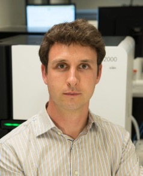
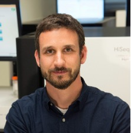

# Meet Your Faculty

#### Obi Griffith

>Professor of Medicine  
Washington University School of Medicine   
St Louis, MO, USA 
>
> --- obigriffith@wustl.edu 
www.griffithlab.org 

Obi’s research is focused on the development of personalized medicine strategies for cancer using genomic technologies. He develops and uses bioinformatics, machine learning and clinical statistics for the analysis of high throughput sequence data and identification of biomarkers for diagnostic, prognostic and drug response prediction. He has led the development of key online informatics resources such as DGIdb, CIViC, GenVisR and more.

#### Malachi Griffith

>Professor of Medicine  
Washington University School of Medicine   
St Louis, MO, USA 
>
> --- mgriffit@wustl.edu 
www.griffithlab.org 

Malachi’s research is focused on the development of genomics and bioinformatics methods as they apply to the study of cancer biology and medicine. A particular focus of his work is in the translation of data from multi-omics sequencing approaches into clinically actionable observations and personalized cancer therapies. He has led the development of key online informatics resources for cancer precision medicine such DGIdb, CIViC, pVACtools and more.

#### Diogo Pellegrina

>Postdoctoral Fellow  
University of Saskatchewan, VIDO   
Saskatoon, SK, Canada
>
> --- diogo.pellegrina@usask.ca

Diogo is a Postdoctoral Fellow at the Vaccines and Infectious Diseases Organisation (VIDO) at USask. Previously I did my PhD in the University of Sao Paulo, and I was also a Postdoc at OICR. I worked with many types of Bioinformatics pipelines, but mostly with Transcriptomics and Network Analysis.

#### Zhibin Lu

>Senior Manager, Digital Research  
University Health Network   
Toronto, ON, Canada
>
> --- zhibin@gmail.com 

Zhibin Lu is a senior manager at University Health Network Digital. He is responsible for UHN HPC operations and scientific software. He manages two HPC clusters at UHN, including system administration, user management, and maintenance of bioinformatics tools for HPC4health. He is also skilled in Next-Gen sequence data analysis and has developed and maintained bioinformatics pipelines at the Bioinformatics and HPC Core. He is a member of the Digital Research Alliance of Canada Bioinformatics National Team and Scheduling National Team.

#### Isabel Risch

>MD/PhD Candidate  
Washington University School of Medicine   
St Louis, MO, USA 
>
> --- irisch@wustl.edu

Isabel is currently a graduate student in the Computational and Systems Biology program at the Washington University (WashU) School of Medicine in St. Louis, Missouri. She also completed her undergraduate education at WashU, where she received B.A.s in Spanish and Biology. She is interested in using bioinformatics to explore the ways in which the immune system interacts with various disease processes, including cancer.

#### Alyona Ivanova

>PhD Candidate  
University of Toronto, the Hospital for Sick Children   
Toronto, Ontario, Canada
>
> --- alyona.ivanova@mail.utoronto.ca

Alyona is a graduate student at the University of Toronto pursuing PhD in Medical Sciences. Her research focuses on identifying novel therapies for targeting chemo-resistance in glioblastoma using spatial ‘omics technologies. She works in close collaboration with clinicians, neuropathologists, scientists bridging the gap between clinical practice and fundamental lab research. Alyona is a Creative Director of Panoramics - A Vision, and an Executive Editor and Director of Distribution of the Institute of Medical Sciences Magazine. 
