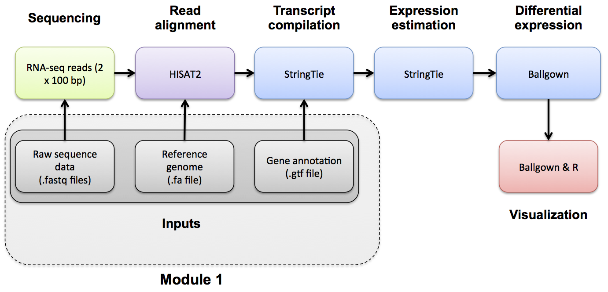

# (PART) Modules {-}

# Module 1

## Lecture

### This is an archived version of what was taught in June 2026. For the most up-to-date material, go [here](https://rnabio.org/)

<!--<iframe width="640" height="360" src="YOUTUBE EMBED LINK" title="YouTube video player" frameborder="0" allow="accelerometer; autoplay; clipboard-write; encrypted-media; gyroscope; picture-in-picture; web-share" referrerpolicy="strict-origin-when-cross-origin" allowfullscreen></iframe>
-->

<iframe width="640" height="360" src="https://www.youtube.com/embed/MQdUbAshk-c?si=fQcjmGWaTE_KhDGn" title="YouTube video player" frameborder="0" allow="accelerometer; autoplay; clipboard-write; encrypted-media; gyroscope; picture-in-picture; web-share" referrerpolicy="strict-origin-when-cross-origin" allowfullscreen></iframe>

<iframe src="https://docs.google.com/presentation/d/173kOvGwbETGrTNPkQRLWs6ZZSWSKvArI/preview" width="640" height="480" allow="autoplay"></iframe>  


## Lab

### 

#### Key concepts
* Review central dogma, RNA sequencing, RNAseq study design, library construction strategies, biological vs technical replicates, alignment strategies, etc.

#### Learning objectives
* Introduction to the theory and practice of RNA sequencing (RNA-seq) analysis
* Rationale for sequencing RNA
* Challenges specific to RNA-seq
* General goals and themes of RNA-seq analysis work flows
* Common technical questions related to RNA-seq analysis
* Getting help outside of this course
* Introduction to the RNA-seq hands on tutorial


***

\

***
<font size="5"><b>Reference Genomes</b></font>

### FASTA/FASTQ/GTF mini lecture
If you would like a refresher on common file formats such as FASTA, FASTQ, and GTF files, we have made a [mini lecture](https://github.com/griffithlab/rnabio.org/blob/master/assets/lectures/cshl/2025/mini/RNASeq_MiniLecture_01_01_FASTA_FASTQ_GTF.pdf) briefly covering these.

### Obtain a reference genome from Ensembl, iGenomes, NCBI or UCSC.

In this example analysis we will use the human GRCh38 version of the genome from Ensembl. Furthermore, we are actually going to perform the analysis using only a single chromosome (chr22) and the ERCC spike-in to make it run faster.

First we will create the necessary working directory.
```bash
cd $RNA_HOME
echo $RNA_REFS_DIR
mkdir -p $RNA_REFS_DIR

```
The complete data from which these files were obtained can be found at: [ftp://ftp.ensembl.org/pub/release-86/fasta/homo_sapiens/dna/](ftp://ftp.ensembl.org/pub/release-86/fasta/homo_sapiens/dna/). You could use wget to download the Homo_sapiens.GRCh38.dna_sm.primary_assembly.fa.gz file, then unzip/untar.

We have prepared this simplified reference for you. It contains chr22 (and ERCC transcript) fasta files in both a single combined file and individual files. Download the reference genome file to the rnaseq working directory

```bash
cd $RNA_REFS_DIR
wget http://genomedata.org/rnaseq-tutorial/fasta/GRCh38/chr22_with_ERCC92.fa
ls

```

View the first 10 lines of this file. Why does it look like this?
```bash
head chr22_with_ERCC92.fa

```

How many lines and characters are in this file? How long is this chromosome (in bases and Mbp)?
```bash
wc chr22_with_ERCC92.fa

```

View 10 lines from approximately the middle of this file. What is the significance of the upper and lower case characters?
```bash
head -n 425000 chr22_with_ERCC92.fa | tail

```

What is the count of each base in the entire reference genome file (skipping the header lines for each sequence)?

```bash
cat chr22_with_ERCC92.fa | grep -v ">" | perl -ne 'chomp $_; $bases{$_}++ for split //; if (eof){print "$_ $bases{$_}\n" for sort keys %bases}'

```

Note: Instead of the above, you might consider getting reference genomes and associated annotations from [UCSC. e.g., UCSC GRCh38 download](http://hgdownload.cse.ucsc.edu/goldenPath/hg38/chromosomes/).

Wherever you get them from, remember that the names of your reference sequences (chromosomes) must those matched in your annotation gtf files (described in the next section).

View a list of all sequences in our reference genome fasta file.

```bash
grep ">" chr22_with_ERCC92.fa

```

***

### Note on complex commands and scripting in Unix
Take a closer look at the command above that counts the occurrence of each nucleotide base in our chr22 reference sequence. Note that for even a seemingly simple question, commands can become quite complex. In that approach, a combination of Unix commands, pipes, and the scripting language Perl are used to answer the question. In bioinformatics, generally this kind of scripting comes up before too long, because you have an analysis question that is so specific there is no out of the box tool available. Or an existing tool will give perform a much more complex and involved analysis than needed to answer a very focused question.

In Unix there are usually many ways to solve the same problem. Perl as a language has mostly fallen out of favor. This kind of simple text parsing problem is one area it perhaps still remains relevant. Let's benchmark the run time of the previous approach and constrast with several alternatives that do not rely on Perl.

Each of the following gives exactly the same answer. `time` is used to measure the run time of each alternative. Each starts by using `cat` to dump the file to standard out and then using `grep` to remove the header lines starting with ">". Each ends with `column -t` to make the output line up consistently.

```
#1. The Perl approach. This command removes the end of line character with chomp, then it splits each line into an array of individual characters, amd it creates a data structure called a hash to store counts of each letter on each line. Once the end of the file is reached it prints out the contents of this data structure in order.  
time cat chr22_with_ERCC92.fa | grep -v ">" | perl -ne 'chomp $_; $bases{$_}++ for split //; if (eof){print "$bases{$_} $_\n" for sort keys %bases}' | column -t

#2. The Awk approach. Awk is an alternative scripting language include in most linux distributions. This command is conceptually very similar to the Perl approach but with a different syntax. A for loop is used to iterate over each character until the end ("NF") is reached. Again the counts for each letter are stored in a simple data structure and once the end of the file is reach the results are printed.  
time cat chr22_with_ERCC92.fa | grep -v ">" | awk '{for (i=1; i<=NF; i++){a[$i]++}}END{for (i in a){print a[i], i}}' FS= - | sort -k 2 | column -t

#3. The Sed approach. Sed is an alternative scripting language. "tr" is used to remove newline characters. Then sed is used simply to split each character onto its own line, effectively creating a file with millions of lines. Then unix sort and uniq are used to produce counts of each unique character, and sort is used to order the results consistently with the previous approaches.
time cat chr22_with_ERCC92.fa | grep -v ">" | tr -d '\n' | sed 's/\(.\)/\1\n/g'  - | sort | uniq -c | sort -k 2 | column -t

#4. The grep appoach. The "-o" option of grep splits each match onto a line which we then use to get a count. The "-i" option makes the matching work for upper/lower case. The "-P" option allows us to use Perl style regular expressions with Greg.
time cat chr22_with_ERCC92.fa | grep -v ">" | grep -i -o -P "a|c|g|t|y|n" | sort | uniq -c

#5. Finally, the simplest/shortest approach that leverages the unix fold command to split each character onto its own line as in the Sed example.
time cat chr22_with_ERCC92.fa | grep -v ">" | fold -w1 | sort | uniq -c | column -t


```
Which method is fastest? Why are the first two approaches so much faster than the others?

***

### PRACTICAL EXERCISE 2 (ADVANCED)
Assignment: Use a commandline scripting approach of your choice to further examine our chr22 reference genome file and answer the following questions.

Questions:
- How many bases on chromosome 22 correspond to repetitive elements?
- What is the percentage of the whole length?
- How many occurences of the EcoRI (GAATTC) restriction site are present in the chromosome 22 sequence?

Hint: Each question can be tackled using approaches similar to those above, using the file 'chr22_with_ERCC92.fa' as a starting point.
Hint: To make things simpler, first produce a file with only the chr22 sequence.
Hint: Remember that repetitive elements in the sequence are represented in lower case

Solution: When you are ready you can check your approach against the [Solutions](#solutions).


***

\

***
<font size="5"><b>Annotations</b></font>

### FASTA/FASTQ/GTF mini lecture
If you would like a refresher on common file formats such as FASTA, FASTQ, and GTF files, we have made a [mini lecture](https://github.com/griffithlab/rnabio.org/blob/master/assets/lectures/cshl/2025/mini/RNASeq_MiniLecture_01_01_FASTA_FASTQ_GTF.pdf) briefly covering these.


### Obtain Known Gene/Transcript Annotations

In this tutorial we will use annotations obtained from Ensembl ([Homo_sapiens.GRCh38.86.gtf.gz](ftp://ftp.ensembl.org/pub/release-86/gtf/homo_sapiens/Homo_sapiens.GRCh38.86.gtf.gz)) for chromosome 22 only. For time reasons, these are prepared for you and made available on your AWS instance. But you should get familiar with sources of gene annotations for RNA-seq analysis.

Copy the gene annotation files to the working directory.

```bash
echo $RNA_REFS_DIR
cd $RNA_REFS_DIR
wget http://genomedata.org/rnaseq-tutorial/annotations/GRCh38/chr22_with_ERCC92.gtf

```

Take a look at the contents of the .gtf file. Press `q` to exit the `less` display.

```bash
echo $RNA_REF_GTF
less -p start_codon -S $RNA_REF_GTF

```

Note how the `-S` option makes it easier to veiw this file with `less`. Make the formatting a bit nicer still:
```bash
cat chr22_with_ERCC92.gtf | column -t | less -p exon -S
```

How many unique gene IDs are in the .gtf file?

We can use a perl command-line command to find out:

```bash
perl -ne 'if ($_ =~ /(gene_id\s\"ENSG\w+\")/){print "$1\n"}' $RNA_REF_GTF | sort | uniq | wc -l

```

* Using `perl -ne ''` will execute the code between single quotes, on the .gtf file, line-by-line.

* The `$_` variable holds the contents of each line.

* The `'if ($_ =~//)'` is a pattern-matching command which will look for the pattern "gene_id" followed by a space followed by "ENSG" and one or more word characters (indicated by `\w+`) surrounded by double quotes.

* The pattern to be matched is enclosed in parentheses. This allows us to print it out from the special variable `$1`.

* The output of this perl command will be a long list of ENSG Ids.

* By piping to `sort`, then `uniq`, then word count we can count the unique number of genes in the file.

We can also use `grep` to find this same information.

```bash
cat chr22_with_ERCC92.gtf | grep -w gene | wc -l

```

* `grep -w gene` is telling grep to do an exact match for the string 'gene'. This means that it will return lines that are of the feature type `gene`.


Now view the structure of a single transcript in GTF format. Press `q` to exit the `less` display when you are done.

```bash
grep ENST00000342247 $RNA_REF_GTF | less -p "exon\s" -S

```

To learn more, see:

* [http://perldoc.perl.org/perlre.html#Regular-Expressions](http://perldoc.perl.org/perlre.html#Regular-Expressions)
* [http://www.perl.com/pub/2004/08/09/commandline.html](http://www.perl.com/pub/2004/08/09/commandline.html)

### Definitions:
**Reference genome** - The nucleotide sequence of the chromosomes of a species. Genes are the functional units of a reference genome and gene annotations describe the structure of transcripts expressed from those gene loci.

**Gene annotations** - Descriptions of gene/transcript models for a genome. A transcript model consists of the coordinates of the exons of a transcript on a reference genome. Additional information such as the strand the transcript is generated from, gene name, coding portion of the transcript, alternate transcript start sites, and other information may be provided.

**GTF (.gtf) file** - A common file format referred to as Gene Transfer Format used to store gene and transcript annotation information. You can learn more about this format here: [http://genome.ucsc.edu/FAQ/FAQformat#format4](http://genome.ucsc.edu/FAQ/FAQformat#format4)

### The Purpose of Gene Annotations (.gtf file)
When running the HISAT2/StringTie/Ballgown pipeline, known gene/transcript annotations are used for several purposes:

* During the HISAT2 index creation step, annotations may be provided to create local indexes to represent transcripts as well as a global index for the entire reference genome. This allows for faster mapping and better mapping across exon boundaries and splice sites. If an alignment still can not be found it will attempt to determine if the read corresponds to a novel exon-exon junction. See the [Indexing section](/module-01-inputs/0001/04/01/Indexing/) and the HISAT2 publication for more details.

* During the StringTie step, a .gtf file can be used to specify transcript models to guide the assembly process and limit expression estimates to predefined transcripts using the `-G` and `-e` options together. The `-e` option will give you one expression estimate for each of the transcripts in your .gtf file, giving you a 'microarray like' expression result.

* During the StringTie step, if the `-G` option is specified without the `-e` option the .gtf file is used only to 'guide' the assembly of transcripts. Instead of assuming only the known transcript models are correct, the resulting expression estimates will correspond to both known and novel/predicted transcripts.

* During the StringTie and gffcompare steps, a .gtf file is used to determine the transcripts that will be examined for differential expression using Ballgown. These may be known transcripts that you download from a public source, or a .gtf of transcripts predicted by StringTie from the read data in an earlier step.

### Sources for obtaining gene annotation files formatted for HISAT2/StringTie/Ballgown
There are many possible sources of .gtf gene/transcript annotation files. For example, from Ensembl, UCSC, RefSeq, etc. Several options and related instructions for obtaining the gene annotation files are provided below.

#### I. ENSEMBL FTP SITE

Based on Ensembl annotations only. Available for many species. [http://useast.ensembl.org/info/data/ftp/index.html](http://useast.ensembl.org/info/data/ftp/index.html)

#### II. UCSC TABLE BROWSER

Based on UCSC annotations or several other possible annotation sources collected by UCSC. You might chose this option if you want to have a lot of flexibility in the annotations you obtain. e.g. to grab only the transcripts from chromosome 22 as in the following example:

* Open the following in your browser: [http://genome.ucsc.edu/](http://genome.ucsc.edu/)
* Select 'Tools' and then 'Table Browser' at the top of the page.
* Select 'Mammal', 'Human', and 'Dec. 2013 (GRCh38/hg38)' from the first row of drop down menus.
* Select 'Genes and Gene Predictions' and 'GENCODE v29' from the second row of drop down menus. To limit your selection to only chromosome 22, select the 'position' option beside 'region', enter 'chr22' in the 'position' box.
* Select 'GTF - gene transfer format' for output format and enter 'UCSC_Genes.gtf' for output file.
* Hit the 'get output' button and save the file. Make note of its location

In addition to the .gtf file you may find uses for some extra files providing alternatively formatted or additional information on the same transcripts. For example:

##### How to get a Gene bed file:

* Change the output format to 'BED - browser extensible data'.
* Change the output file to 'UCSC_Genes.bed', and hit the 'get output' button.
* Make sure 'Whole Gene' is selected, hit the 'get BED' button, and save the file.

##### How to get an Exon bed file:

* Go back one page in your browser and change the output file to 'UCSC_Exons.bed', then hit the 'get output' button again.
* Select 'Exons plus', enter 0 in the adjacent box, hit the 'get BED' button, and save the file.

##### How to get gene symbols and descriptions for all UCSC genes:

* Again go back one page in your browser and change the 'output format' to 'selected fields from primary and related tables'.
* Change the output file to 'UCSC_Names.txt', and hit the 'get output' button.
* Make sure 'chrom' is selected near the top of the page.
* Under 'Linked Tables' make sure 'kgXref' is selected, and then hit 'Allow Selection From Checked Tables'. This will link the table and give you access to its fields.
* Under 'hg38.kgXref fields' select: 'kgID', 'geneSymbol', 'description'.
* Hit the 'get output' button and save the file.
* To get annotations for the whole genome, make sure 'genome' is selected beside 'region'. By default, the files downloaded above will be compressed. To decompress, use 'gunzip filename' in linux.

#### III. HISAT2 Precomputed Genome Index

HISAT2 has prebuilt reference genome index files for both DNA and RNA alignment. Various versions of the index files include SNPs and/or transcript splice sites. Versions of both the Ensembl and UCSC genomes for human build 38 are linked from the main HISAT2 page: [https://ccb.jhu.edu/software/hisat2/index.shtml](https://ccb.jhu.edu/software/hisat2/index.shtml)

Or those same files are directly available from their FTP site: [ftp://ftp.ccb.jhu.edu/pub/infphilo/hisat2/data/](ftp://ftp.ccb.jhu.edu/pub/infphilo/hisat2/data/)

### Important notes:
**On chromosome naming conventions:**
In order for your RNA-seq analysis to work, the chromosome names in your .gtf file must match those in your reference genome (i.e. your reference genome fasta file). If you get a StringTie result where all transcripts have an expression value of 0, you may have overlooked this. Unfortunately, Ensembl, NCBI, and UCSC can not agree on how to name the chromosomes in many species, so this problem may come up often. You can avoid this by getting a complete reference genome and gene annotation package from the same source (e.g., Ensembl) to maintain consistency.

**On reference genome builds:**
Your annotations must correspond to the same reference genome build as your reference genome fasta file. e.g., both correspond to UCSC human build 'hg38', NCBI human build 'GRCh38', etc. Even if both your reference genome and annotations are from UCSC or Ensembl they could still correspond to different versions of that genome. This would cause problems in any RNA-seq pipeline.

A more detailed discussion of commonly used version of the human reference genome can be found in a companion workshop [PMBIO Reference Genomes](https://pmbio.org/module-02-inputs/0002/02/01/Reference_Genome/).


***

\

***

<font size="5"><b>Indexing</b></font>

### Indexing mini lecture
If you want a refresher on indexing, we have made an [indexing mini lecture](https://github.com/griffithlab/rnabio.org/blob/master/assets/lectures/cbw/2026/mini/RNASeq_MiniLecture_01_02_Indexing.pdf) available.

### Create a HISAT2 index
Create a HISAT2 index for chr22 and the ERCC spike-in sequences. HISAT2 can incorporate exons and splice sites into the index file for alignment. First create a splice site file, then an exon file. Finally make the aligner FM index.

To learn more about how the HISAT2 indexing strategy is distinct from other next gen aligners refer to the [HISAT publication](https://www.ncbi.nlm.nih.gov/pubmed/25751142).

```bash
cd $RNA_REFS_DIR
hisat2_extract_splice_sites.py $RNA_REF_GTF > $RNA_REFS_DIR/splicesites.tsv
hisat2_extract_exons.py $RNA_REF_GTF > $RNA_REFS_DIR/exons.tsv
hisat2-build -p 4 --ss $RNA_REFS_DIR/splicesites.tsv --exon $RNA_REFS_DIR/exons.tsv $RNA_REF_FASTA $RNA_REF_INDEX
ls

```

Perform a visual survey on the contents of your refs directory. What is the source/purpose of each file.

**[OPTIONAL]** To create an index for all chromosomes instead of just chr22 you would do something like the following:

**WARNING:** In order to index the entire human genome, HISAT2 requires 160GB of RAM. Your AWS instance size will run out of RAM.

```bash
#hisat2_extract_splice_sites.py Homo_sapiens.GRCh38.86.gtf > splicesites.tsv
#hisat2_extract_exons.py Homo_sapiens.GRCh38.86.gtf > exons.tsv
#hisat2-build -p 4 --ss splicesites.tsv --exon exons.tsv Homo_sapiens.GRCh38.dna_sm.primary_assembly.fa Homo_sapiens.GRCh38.dna_sm.primary_assembly
```

***

\

***
<font size="5"><b>RNAseq Data</b></font>

### Obtain RNA-seq test data.
The test data consists of two commercially available RNA samples: [Universal Human Reference (UHR)](/assets/module_1/UHR.pdf) and [Human Brain Reference (HBR)](/assets/module_1/HBR.pdf). The UHR is total RNA isolated from a diverse set of 10 cancer cell lines (breast, liver, cervix, testis, brain, skin, fatty tissue, histocyte, macrophage, T cell, B cell). The HBR is total RNA isolated from the brains of 23 Caucasians, male and female, of varying age but mostly 60-80 years old.

In addition, a spike-in control was used. Specifically we added an aliquot of the [ERCC ExFold RNA Spike-In Control Mixes](/assets/module_1/ERCC.pdf) to each sample. The spike-in consists of 92 transcripts that are present in known concentrations across a wide abundance range (from very few copies to many copies). This range allows us to test the degree to which the RNA-seq assay (including all laboratory and analysis steps) accurately reflects the relative abundance of transcript species within a sample. There are two 'mixes' of these transcripts to allow an assessment of differential expression output between samples if you put one mix in each of your two comparisons. In our case, Mix1 was added to the UHR sample, and Mix2 was added to the HBR sample. We also have 3 complete experimental replicates for each sample. This allows us to assess the technical variability of our overall process of producing RNA-seq data in the lab.

From the ERCC product sheet:

> The ERCC plasmid reference library produces well-characterized transcripts generated largely from random unique sequences. Sequence comparisons have been made to multiple databases available at the time of design including mouse, rat, human, Drosophila, bacteria, mosquito, and other nonhuman species. The control collection contains some sequences with homology to Bacillus subtilis.

For all libraries we prepared low-throughput (Set A) TruSeq Stranded Total RNA Sample Prep Kit libraries with Ribo-Zero Gold to remove both cytoplasmic and mitochondrial rRNA. Triplicate, indexed libraries were made starting with 100ng Agilent/Strategene Universal Human Reference total RNA and 100ng Ambion Human Brain Reference total RNA. The Universal Human Reference replicates received 2 ul of 1:1000 ERCC Mix 1. The Human Brain Reference replicates received 2 ul of 1:1000 ERCC Mix 2. The libraries were quantified with KAPA Library Quantification qPCR and adjusted to the appropriate concentration for sequencing. The triplicate, indexed libraries were then pooled prior to sequencing. Each pool of three replicate libraries were sequenced across 2 lanes of a HiSeq 2000 using paired-end sequence chemistry with 100 bp read lengths.

So to summarize we have:

* UHR + ERCC Spike-In Mix1, Replicate 1
* UHR + ERCC Spike-In Mix1, Replicate 2
* UHR + ERCC Spike-In Mix1, Replicate 3
* HBR + ERCC Spike-In Mix2, Replicate 1
* HBR + ERCC Spike-In Mix2, Replicate 2
* HBR + ERCC Spike-In Mix2, Replicate 3

Each data set has a corresponding pair of FASTQ files (read 1 and read 2 of paired end reads).

```bash
echo $RNA_DATA_DIR
mkdir -p $RNA_DATA_DIR
cd $RNA_DATA_DIR
wget http://genomedata.org/rnaseq-tutorial/HBR_UHR_ERCC_ds_5pc.tar

```

Unpack the test data using tar. You should see 6 sets of paired end fastq files. One for each of our sample replicates above. We have 6 pairs (12 files) because in fastq format, read 1 and read 2 of a each read pair (fragment) are stored in separate files.

```bash
tar -xvf HBR_UHR_ERCC_ds_5pc.tar
ls

```

Enter the data directory and view the first two read records of a file (in fastq format each read corresponds to 4 lines of data)

The reads are paired-end 101-mers generated on an Illumina HiSeq instrument. The test data has been pre-filtered for reads that appear to map to chromosome 22. Lets copy the raw input data to our tutorial working directory.
```bash
zcat UHR_Rep1_ERCC-Mix1_Build37-ErccTranscripts-chr22.read1.fastq.gz | head -n 8

```

Identify the following components of each read: read name, read sequence, and quality string

How many reads are there in the first library? Decompress file on the fly with 'zcat', pipe into 'grep', search for the read name prefix and pipe into 'wc' to do a word count ('-l' gives lines)

```bash
zcat UHR_Rep1_ERCC-Mix1_Build37-ErccTranscripts-chr22.read1.fastq.gz | grep -P "^\@HWI" | wc -l

```

### Determining the strandedness of RNA-seq data (Optional)

In order to determine strandedness, we will be using [check_strandedness](https://github.com/betsig/how_are_we_stranded_here)([docker image](https://hub.docker.com/r/mgibio/checkstrandedness)). In order use this tool, there are a few steps we need to get our inputs ready, specifically creating a fasta of our GTF file.

To create a transcripts FASTA file from our reference transcriptome in GTF format we need to get our transcript information into BED12 format. To get to that format we will convert GTF -> GenePred -> BED12. The GenePred format is just an intermediate that we create because we did not find a tool that would convert straight from GTF to BED12. 

Once we have our transcriptome information (the position of exons for each transcript on each chromosome) we can use `bedtools getfasta` to splice the exon sequences from the chromosome sequence together into a full length transcript sequence.

```bash
cd $RNA_HOME/refs/

# Convert our reference transcriptome GTF to genePred format
gtfToGenePred chr22_with_ERCC92.gtf chr22_with_ERCC92.genePred

# Convert the genPred format to bed12 format
genePredToBed chr22_with_ERCC92.genePred chr22_with_ERCC92.bed12

# Use bedtools to create fasta from GTF
bedtools getfasta -fi chr22_with_ERCC92.fa -bed chr22_with_ERCC92.bed12 -s -split -name -fo chr22_ERCC92_transcripts.fa

```

Use less to view the file chr22_ERCC92_transcripts.fa. Note that this file has messy transcript names. Use the following hairball perl one-liner to tidy up the header line for each fasta sequence.

```bash
cd $RNA_HOME/refs
cat chr22_ERCC92_transcripts.fa | perl -ne 'if($_ =~/^\>\S+\:\:(ERCC\-\d+)\:.*/){print ">$1\n"}elsif ($_ =~/^\>(\S+)\:\:.*/){print ">$1\n"}else{print $_}' > chr22_ERCC92_transcripts.clean.fa

```

View the resulting ‘clean’ file using `less chr22_ERCC92_transcripts.clean.fa` (use 'q' to exit). View the end of this file using `tail chr22_ERCC92_transcripts.clean.fa`. Note that we have one fasta record for each Ensembl transcript on chromosome 22 and we have an additional fasta record for each ERCC spike-in sequence.

We also need to reformat our GTF file slightly. Rows that correspond to genes are missing the "transcript_id" field. We are going to add in this field but leave it blank for these rows using the following command.

```bash
cd $RNA_HOME/refs
awk '{ if ($0 ~ "transcript_id") print $0; else print $0" transcript_id \"\";"; }' chr22_with_ERCC92.gtf > chr22_with_ERCC92_tidy.gtf

```

Now that we have created our input files, we can now run the check_strandedness tool on some of our instrument data. Note: we are using a docker image for this tool.

```bash
docker run -v /home/ubuntu/workspace/rnaseq:/docker_workspace mgibio/checkstrandedness:latest check_strandedness --gtf /docker_workspace/refs/chr22_with_ERCC92_tidy.gtf --transcripts /docker_workspace/refs/chr22_ERCC92_transcripts.clean.fa --reads_1 /docker_workspace/data/HBR_Rep1_ERCC-Mix2_Build37-ErccTranscripts-chr22.read1.fastq.gz --reads_2 /docker_workspace/data/HBR_Rep1_ERCC-Mix2_Build37-ErccTranscripts-chr22.read2.fastq.gz
```
`docker run` is how you initialize a docker container to run a command

`-v` is the parameter used to mount your workspace so that the docker container can see the files that you're working with. In the example above, `/home/ubuntu/workspace/rnaseq` from the EC2 instance has been mounted as `/docker_workspace` within the docker container. 

`mgibio/checkstrandedness` is the docker container name. The `:latest` refers to the specific tag and release of the docker container.


The output of this command should look like so:
```bash
Fraction of reads failed to determine: 0.1123
Fraction of reads explained by "1++,1--,2+-,2-+": 0.0155
Fraction of reads explained by "1+-,1-+,2++,2--": 0.8722
Over 75% of reads explained by "1+-,1-+,2++,2--"
Data is likely RF/fr-firststrand
```

The checkstrandedness test asks a single question: in each read pair, which mate aligns in the same orientation as the gene it overlaps? The tool encodes every read as `read#` + `aligned strand` + `gene strand`, then sorts reads into two patterns. For the 'reverse' pattern `1+-,1-+,2++,2--`: read 2 always agrees with the gene's strand (2++, 2--) while read 1 always disagrees (1+-, 1-+). For the 'forward' pattern `1++,1--,2+-,2-+` is the exact mirror, with read 1 always agreeing and read 2 always disagreeing. The four codes within each pattern aren't independent observations; they're that one orientation rule applied to genes on the + strand and the - strand, which is why all four always appear together. In a dUTP/fr-firststrand prep, first-strand cDNA is synthesized antisense to the mRNA, the dUTP-marked second strand is degraded before amplification, and the adapters are arranged so read 1 sequences the surviving antisense strand while read 2 reads its sense complement. So read 2 matches the transcript and read 1 opposes it. The two names describe the same molecule from different angles: "first-strand" refers to the cDNA strand that is retained, and "reverse" refers to read 1 pointing opposite the transcript. In this case, 87.22% of reads fall in the reverse pattern, only 1.55% in the forward pattern, and 11.23% are undetermined (overlapping genes, multimappers, and ambiguous orientation, all expected and harmless). This strong bias toward `1+-,1-+,2++,2--` suggests an unambiguous RF / fr-firststrand call. A forward-stranded library would have put the bulk in the other bin. And an unstranded library would have split close to 50:50.

Using this [table](https://rnabio.org/module-09-appendix/0009/12/01/StrandSettings/), we can see if this result is what we expect. Note that since the UHR and HBR data were generated with the TruSeq Stranded Kit, as mentioned above, the correct strand setting for kallisto is `--rf-stranded`, which is what check_strandedness confirms. Similarly when we run HISAT we will use `--rna-strandness RF`, when we run StringTie we will use `--rf`, and when we run htseq-count we will use `--stranded reverse`.

***

### PRACTICAL EXERCISE 3
Assignment: Download an additional dataset and unpack it. This data will be used in future practical exercises.

* Hint: Do this in a separate working directory called ‘practice’ and create sub-directories for organization (data, alignments, etc).
* In this exercise you will download an archive of publicly available read data from here: [http://genomedata.org/rnaseq-tutorial/practical.tar](http://genomedata.org/rnaseq-tutorial/practical.tar)

The practice dataset includes 3 replicates of data from the HCC1395 breast cancer cell line and 3 replicates of data from HCC1395BL matched lymphoblastoid line. So, this will be a tumor vs normal (cell line) comparison. The reads are paired-end 151-mers generated on an Illumina HiSeq instrument from TruSeq Stranded Total RNA Libraries. The test data has been pre-filtered for reads that appear to map to chromosome 22.

**Questions**

* How many data files were contained in the 'practical.tar' archive? What commonly used sequence data file format are they?
* In the first read of the hcc1395, normal, replicate 1, read 1 file, what was the physical location of the read on the flow cell (i.e. lane, tile, x, y)?
* In the first read of this same file, how many 'T' bases are there?

Solution: When you are ready you can check your approach against the [Solutions](/module-09-appendix/0009/05/01/Practical_Exercise_Solutions/#practical-exercise-3---data).

***

**NOTE**: The complete RAW HCC1395 data sets can be found here: [http://genomedata.org/pmbio-workshop/fastqs/all/](http://genomedata.org/pmbio-workshop/fastqs/all/)

If you use this data, please cite our paper: [Citation](https://github.com/griffithlab/rnaseq_tutorial/wiki/Citation)


***

\

***

<font size="5"><b>Pre-alignment QC</b></font>

### FastQC

You can use `FastQC` to get a sense of your data quality before alignment:

* [http://www.bioinformatics.babraham.ac.uk/projects/fastqc/](http://www.bioinformatics.babraham.ac.uk/projects/fastqc/)

Video Tutorial here:

* [http://www.youtube.com/watch?v=bz93ReOv87Y](http://www.youtube.com/watch?v=bz93ReOv87Y)

Try to run FastQC on your fastq files:

```bash
cd $RNA_HOME/data
fastqc *.fastq.gz

```

Then, go to the following url in your browser:

* http://**YOUR_PUBLIC_IPv4_ADDRESS**/rnaseq/data/
* Note, you must replace **YOUR_PUBLIC_IPv4_ADDRESS** with your own amazon instance DNS (e.g., ec2-54-187-159-113.us-west-2.compute.amazonaws.com))
* Click on any of the `*_fastqc.html` files to view the FastQC report

**Exercise:**
Investigate the source/explanation for over-represented sequences:

* HINT: Try BLASTing them.

***

### Fastp

`Fastp` is a similar alternative tool. QC results for this tool can be produced as follows

```bash
cd $RNA_HOME/data
mkdir fastp
cd fastp
mkdir HBR_Rep1 HBR_Rep2 HBR_Rep3 UHR_Rep1 UHR_Rep2 UHR_Rep3

cd $RNA_HOME/data/fastp/HBR_Rep1
fastp -i $RNA_HOME/data/HBR_Rep1_ERCC-Mix2_Build37-ErccTranscripts-chr22.read1.fastq.gz -I $RNA_HOME/data/HBR_Rep1_ERCC-Mix2_Build37-ErccTranscripts-chr22.read2.fastq.gz

cd $RNA_HOME/data/fastp/HBR_Rep2
fastp -i $RNA_HOME/data/HBR_Rep2_ERCC-Mix2_Build37-ErccTranscripts-chr22.read1.fastq.gz -I $RNA_HOME/data/HBR_Rep2_ERCC-Mix2_Build37-ErccTranscripts-chr22.read2.fastq.gz

cd $RNA_HOME/data/fastp/HBR_Rep3
fastp -i $RNA_HOME/data/HBR_Rep3_ERCC-Mix2_Build37-ErccTranscripts-chr22.read1.fastq.gz -I $RNA_HOME/data/HBR_Rep3_ERCC-Mix2_Build37-ErccTranscripts-chr22.read2.fastq.gz

cd $RNA_HOME/data/fastp/UHR_Rep1
fastp -i $RNA_HOME/data/UHR_Rep1_ERCC-Mix1_Build37-ErccTranscripts-chr22.read1.fastq.gz -I $RNA_HOME/data/UHR_Rep1_ERCC-Mix1_Build37-ErccTranscripts-chr22.read2.fastq.gz

cd $RNA_HOME/data/fastp/UHR_Rep2
fastp -i $RNA_HOME/data/UHR_Rep2_ERCC-Mix1_Build37-ErccTranscripts-chr22.read1.fastq.gz -I $RNA_HOME/data/UHR_Rep2_ERCC-Mix1_Build37-ErccTranscripts-chr22.read2.fastq.gz

cd $RNA_HOME/data/fastp/UHR_Rep3
fastp -i $RNA_HOME/data/UHR_Rep3_ERCC-Mix1_Build37-ErccTranscripts-chr22.read1.fastq.gz -I $RNA_HOME/data/UHR_Rep3_ERCC-Mix1_Build37-ErccTranscripts-chr22.read2.fastq.gz

```

***

### MultiQC

Run MultiQC on your fastqc reports to generate a single summary report across all samples/replicates.

```bash
cd $RNA_HOME/data
multiqc ./
```

Then, go to the following url in your browser:
* http://**YOUR_PUBLIC_IPv4_ADDRESS**/rnaseq/data/multiqc_report.html


### Clean up

Move all the FASTQC files into their own directory

```bash
cd $RNA_HOME/data
mkdir fastqc
mv *_fastqc* fastqc

```


### PRACTICAL EXERCISE 4
Assignment: Run FASTQC on one of the additional fastq files you downloaded in the previous practical exercise.

* Hint: Remember that you stored this data in a separate working directory called ‘practice’.

Run FASTQC on the file 'hcc1395_normal_1.fastq.gz' and answer these questions by examining the output.

**Questions**

* How many total sequences are there?
* What is the range (x - y) of read lengths observed?
* What is the most common average sequence quality score?
* What does the Adaptor Content warning tell us?

Solution: When you are ready you can check your approach against the [Solutions](/module-09-appendix/0009/05/01/Practical_Exercise_Solutions/#practical-exercise-4---data-qc).

***
