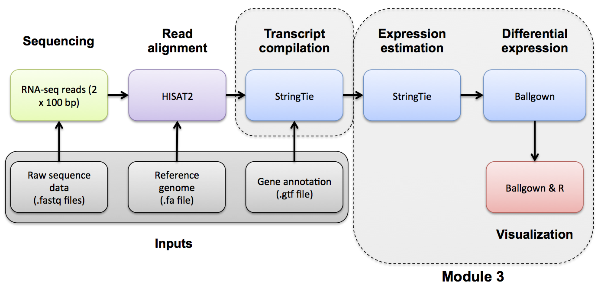
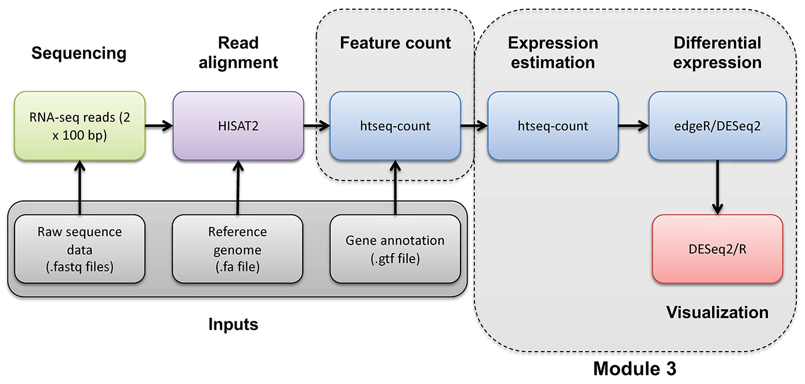
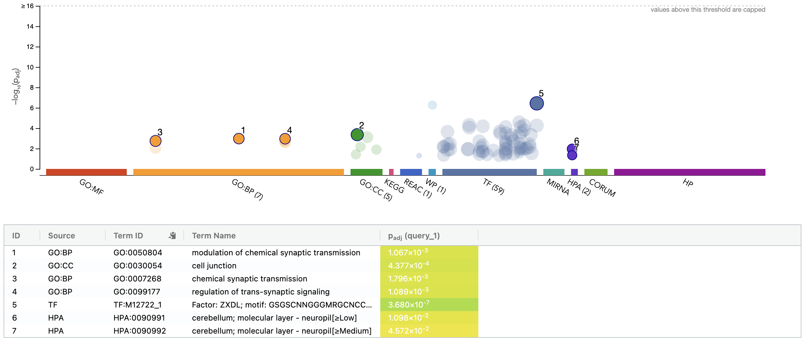
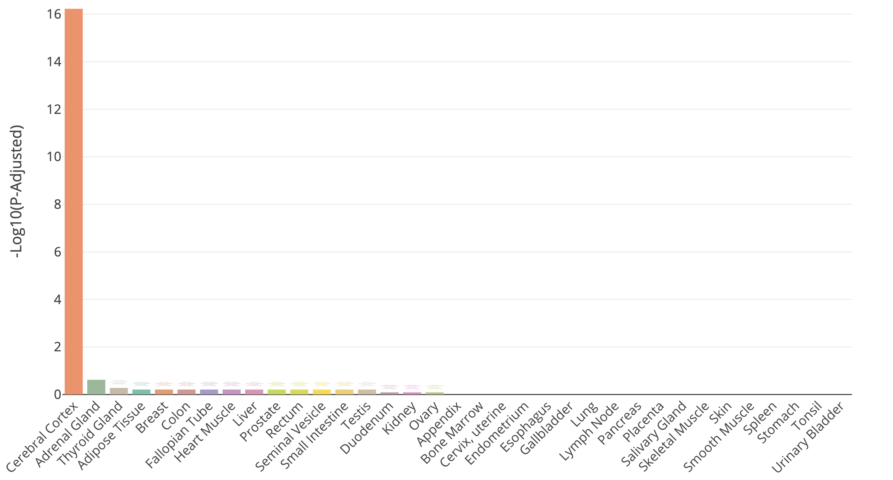
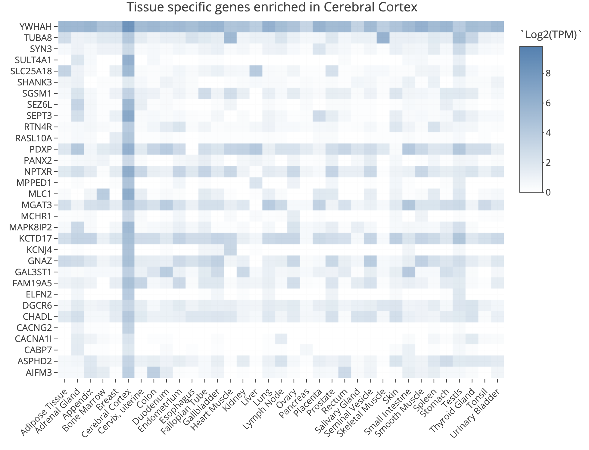
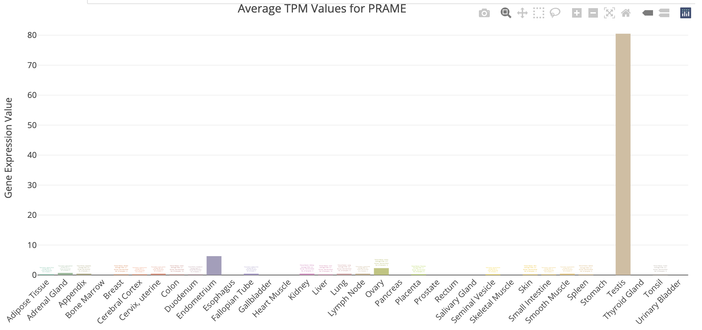
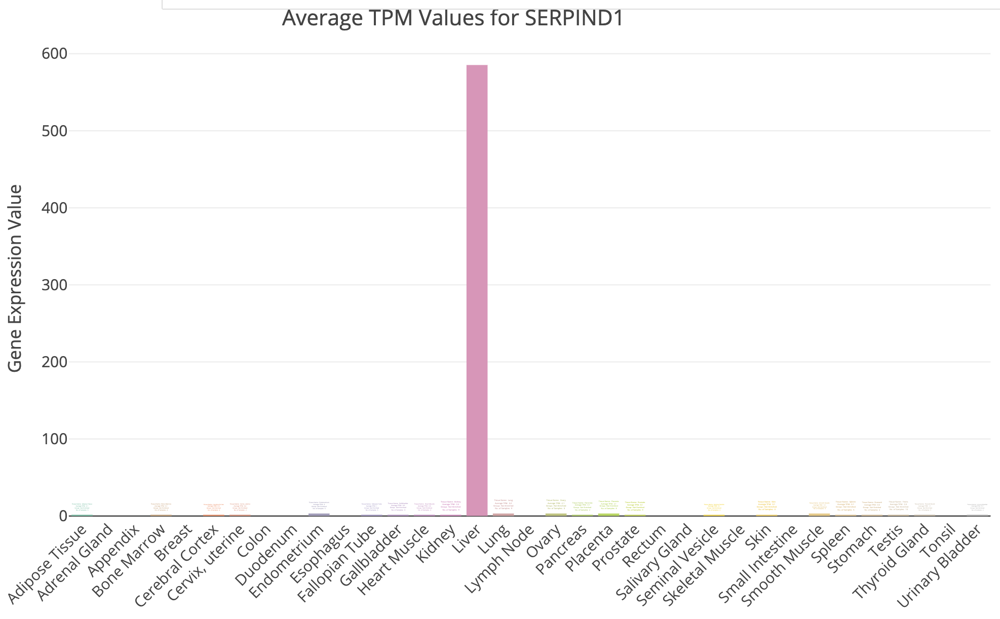
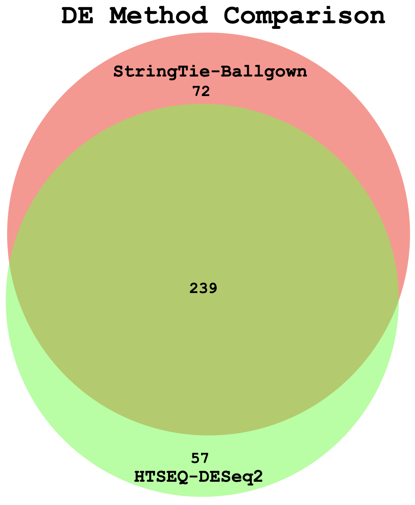
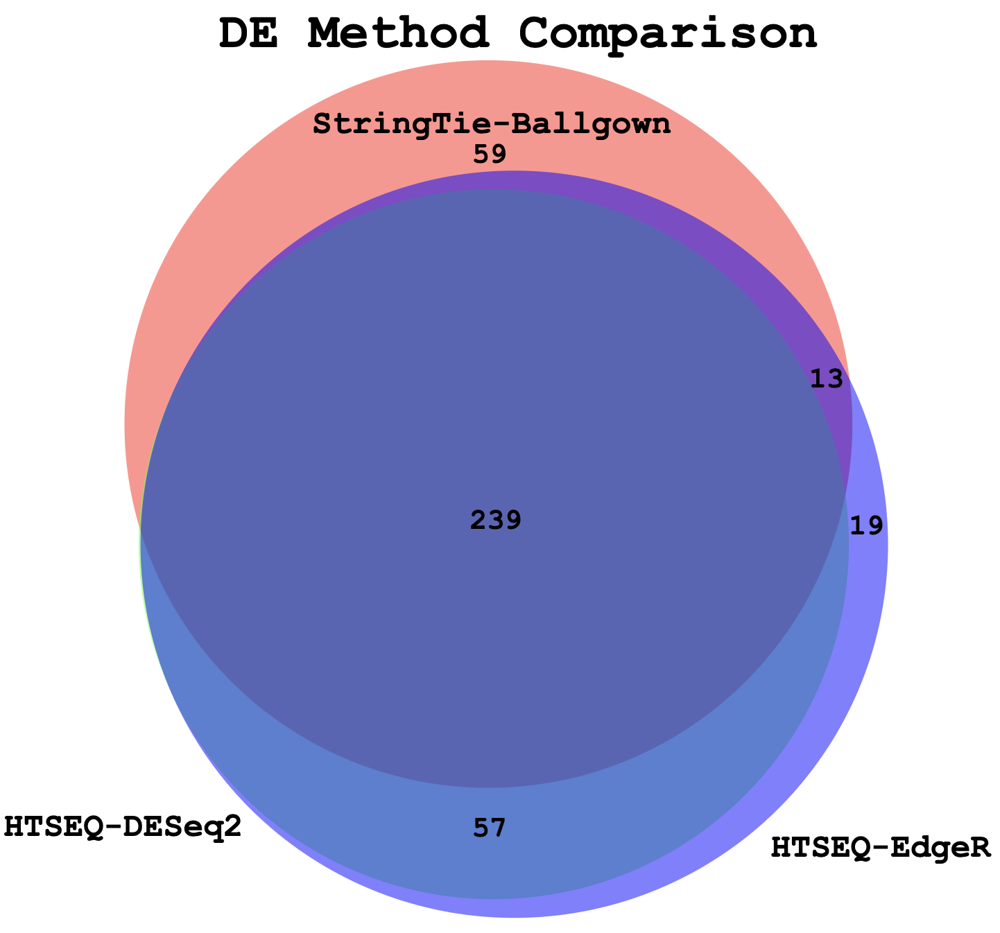

# Module 3

## Lecture

### This is an archived version of what was taught in June 2026. For the most up-to-date material, go [here](https://rnabio.org/)

<!--<iframe width="640" height="360" src="YOUTUBE EMBED LINK" title="YouTube video player" frameborder="0" allow="accelerometer; autoplay; clipboard-write; encrypted-media; gyroscope; picture-in-picture; web-share" referrerpolicy="strict-origin-when-cross-origin" allowfullscreen></iframe>
-->

<iframe src="https://docs.google.com/presentation/d/1keQf2jYlZSqPdDjucAFhPsAzxrsLdZta/preview" width="640" height="480" allow="autoplay"></iframe>  


## Lab


***

\

***

<font size="5"><b>Expression Analysis with Stringtie and htseq-count</b></font>

### Expression mini lecture
If you would like a refresher on expression and abundance estimations, we have made a [mini lecture](https://github.com/griffithlab/rnabio.org/blob/master/assets/lectures/cbw/2026/mini/RNASeq_MiniLecture_03_01_AbundanceEstimation.pdf).

### Use Stringtie to generate expression estimates from the SAM/BAM files generated by HISAT2 in the previous module


#### Note on de novo transcript discovery and differential expression using Stringtie:
In this module, we will run Stringtie in 'reference only' mode. For simplicity and to reduce run time, it is sometimes useful to perform expression analysis with only known transcript models. However, Stringtie can predict the transcripts present in each library instead (by dropping the '-G' option in stringtie commands as described in the next module). Stringtie will then assign arbitrary transcript IDs to each transcript assembled from the data and estimate expression for those transcripts. One complication with this method is that in each library a different set of transcripts is likely to be predicted for each library. There may be a lot of similarities but the number of transcripts and their exact structure will differ in the output files for each library. Before you can compare across libraries you therefore need to determine which transcripts correspond to each other across the libraries.

* Stringtie provides a merge command to combine predicted transcript GTF files from across different libraries
* Once you have a merged GTF file you can run Stringtie **again** with this instead of the known transcripts GTF file we used above
* Stringtie also provides 'gffcompare' to compare predicted transcripts to known transcripts
* Refer to the Stringtie manual for a more detailed explanation:
* [https://ccb.jhu.edu/software/stringtie/index.shtml?t=manual](https://ccb.jhu.edu/software/stringtie/index.shtml?t=manual)

Stringtie basic usage:

```bash
    stringtie <aligned_reads.bam> [options]*
```

Extra options specified below:

* '--rf' tells StringTie that our data is stranded and to use the correct strand specific mode (i.e. assume a stranded library fr-firststrand).
* '-p 4' tells StringTie to use 4 CPUs
* '-G <known transcripts file>' reference annotation to use for guiding the assembly process (GTF/GFF3)
* '-e' only estimate the abundance of given reference transcripts (requires -G)
* '-B' enable output of Ballgown table files which will be created in the same directory as the output GTF (requires -G, -o recommended)
* '-o' output path/file name for the assembled transcripts GTF (default: stdout)
* '-A' output path/file name for gene abundance estimates

```bash
cd $RNA_HOME/
mkdir -p expression/stringtie/ref_only/
cd expression/stringtie/ref_only/

stringtie --rf -p 4 -G $RNA_REF_GTF -e -B -o HBR_Rep1/transcripts.gtf -A HBR_Rep1/gene_abundances.tsv $RNA_ALIGN_DIR/HBR_Rep1.bam
stringtie --rf -p 4 -G $RNA_REF_GTF -e -B -o HBR_Rep2/transcripts.gtf -A HBR_Rep2/gene_abundances.tsv $RNA_ALIGN_DIR/HBR_Rep2.bam
stringtie --rf -p 4 -G $RNA_REF_GTF -e -B -o HBR_Rep3/transcripts.gtf -A HBR_Rep3/gene_abundances.tsv $RNA_ALIGN_DIR/HBR_Rep3.bam

stringtie --rf -p 4 -G $RNA_REF_GTF -e -B -o UHR_Rep1/transcripts.gtf -A UHR_Rep1/gene_abundances.tsv $RNA_ALIGN_DIR/UHR_Rep1.bam
stringtie --rf -p 4 -G $RNA_REF_GTF -e -B -o UHR_Rep2/transcripts.gtf -A UHR_Rep2/gene_abundances.tsv $RNA_ALIGN_DIR/UHR_Rep2.bam
stringtie --rf -p 4 -G $RNA_REF_GTF -e -B -o UHR_Rep3/transcripts.gtf -A UHR_Rep3/gene_abundances.tsv $RNA_ALIGN_DIR/UHR_Rep3.bam

```

What does the raw output from Stringtie look like? For details on the Stringtie output files refer to [Stringtie manual](https://ccb.jhu.edu/software/stringtie/index.shtml?t=manual) ([outputs section](https://ccb.jhu.edu/software/stringtie/index.shtml?t=manual#output))

```bash
less -S UHR_Rep1/transcripts.gtf
```

View transcript records only and improve formatting
```bash
grep -v "^#" UHR_Rep1/transcripts.gtf | grep -w "transcript" | column -t | less -S

```

Limit the view to transcript records and their expression values (FPKM and TPM values)

```bash
awk '{if ($3=="transcript") print}' UHR_Rep1/transcripts.gtf | cut -f 1,4,9 | less -S

```

Press 'q' to exit the 'less' display

Gene and transcript level expression values can also be viewed in these two files:

```bash
column -t UHR_Rep1/t_data.ctab | less -S

less -S -x20 UHR_Rep1/gene_abundances.tsv

```

Create a tidy expression matrix files for the StringTie results. This will be done at both the gene and transcript level and also will take into account the various expression measures produced: coverage, FPKM, and TPM.

```bash
cd $RNA_HOME/expression/stringtie/ref_only/
wget https://raw.githubusercontent.com/griffithlab/rnabio.org/master/assets/scripts/stringtie_expression_matrix.pl
chmod +x stringtie_expression_matrix.pl

./stringtie_expression_matrix.pl --expression_metric=TPM --result_dirs='HBR_Rep1,HBR_Rep2,HBR_Rep3,UHR_Rep1,UHR_Rep2,UHR_Rep3' --transcript_matrix_file=transcript_tpm_all_samples.tsv --gene_matrix_file=gene_tpm_all_samples.tsv

./stringtie_expression_matrix.pl --expression_metric=FPKM --result_dirs='HBR_Rep1,HBR_Rep2,HBR_Rep3,UHR_Rep1,UHR_Rep2,UHR_Rep3' --transcript_matrix_file=transcript_fpkm_all_samples.tsv --gene_matrix_file=gene_fpkm_all_samples.tsv

./stringtie_expression_matrix.pl --expression_metric=Coverage --result_dirs='HBR_Rep1,HBR_Rep2,HBR_Rep3,UHR_Rep1,UHR_Rep2,UHR_Rep3' --transcript_matrix_file=transcript_coverage_all_samples.tsv --gene_matrix_file=gene_coverage_all_samples.tsv

column -t transcript_tpm_all_samples.tsv | less -S
column -t gene_tpm_all_samples.tsv | less -S

```

Later we will use these files to perform various comparisons of expression estimation tools (e.g. stringtie, kallisto, raw counts) and metrics (e.g. FPKM vs TPM).

***

### PRACTICAL EXERCISE 8
Assignment: Use StringTie to Calculate transcript-level expression estimates for the alignments (bam files) you created in Practical Exercise 6.

* Hint: You should have six commands for 3 replicates each of tumor and normal samples.

Solution: When you are ready you can check your approach against the [Solutions](/module-09-appendix/0009/05/01/Practical_Exercise_Solutions/#practical-exercise-8---expression)

***

\

***


#### Mini-lecture

For more on the differences between abundance estimates like FPKM and count data with HTSeq-count, see this [mini lecture](https://github.com/griffithlab/rnabio.org/blob/master/assets/lectures/cbw/2026/mini/RNASeq_MiniLecture_03_02_HTSEQ.pdf).

***

#### HTSEQ-COUNT
Run htseq-count on alignments instead to produce raw counts instead of FPKM/TPM values for differential expression analysis

Refer to the HTSeq documentation for a more detailed explanation:

* [https://htseq.readthedocs.io/en/release_0.11.1/count.html](https://htseq.readthedocs.io/en/release_0.11.1/count.html)

htseq-count basic usage:

```bash
htseq-count [options] <sam_file> <gff_file>
```

Extra options specified below:

* '--format' specify the input file format one of BAM or SAM. Since we have BAM format files, select 'bam' for this option.
* '--order' provide the expected sort order of the input file. Previously we generated position sorted BAM files so use 'pos'.
* '--mode' determines how to deal with reads that overlap more than one feature. We believe the 'intersection-strict' mode is best.
* '--stranded' specifies whether data is stranded or not. The TruSeq strand-specific RNA libraries suggest the 'reverse' option for this parameter.
* '--minaqual' will skip all reads with alignment quality lower than the given minimum value
* '--type' specifies the feature type (3rd column in GFF file) to be used. (default, suitable for RNA-Seq and Ensembl GTF files: exon)
* '--idattr' The feature ID used to identify the counts in the output table. The default, suitable for RNA-SEq and Ensembl GTF files, is gene_id.

Run htseq-count and calculate gene-level counts:

```bash
cd $RNA_HOME/
mkdir -p expression/htseq_counts
cd expression/htseq_counts

htseq-count --format bam --order pos --mode intersection-strict --stranded reverse --minaqual 1 --type exon --idattr gene_id $RNA_ALIGN_DIR/UHR_Rep1.bam $RNA_REF_GTF > UHR_Rep1_gene.tsv
htseq-count --format bam --order pos --mode intersection-strict --stranded reverse --minaqual 1 --type exon --idattr gene_id $RNA_ALIGN_DIR/UHR_Rep2.bam $RNA_REF_GTF > UHR_Rep2_gene.tsv
htseq-count --format bam --order pos --mode intersection-strict --stranded reverse --minaqual 1 --type exon --idattr gene_id $RNA_ALIGN_DIR/UHR_Rep3.bam $RNA_REF_GTF > UHR_Rep3_gene.tsv

htseq-count --format bam --order pos --mode intersection-strict --stranded reverse --minaqual 1 --type exon --idattr gene_id $RNA_ALIGN_DIR/HBR_Rep1.bam $RNA_REF_GTF > HBR_Rep1_gene.tsv
htseq-count --format bam --order pos --mode intersection-strict --stranded reverse --minaqual 1 --type exon --idattr gene_id $RNA_ALIGN_DIR/HBR_Rep2.bam $RNA_REF_GTF > HBR_Rep2_gene.tsv
htseq-count --format bam --order pos --mode intersection-strict --stranded reverse --minaqual 1 --type exon --idattr gene_id $RNA_ALIGN_DIR/HBR_Rep3.bam $RNA_REF_GTF > HBR_Rep3_gene.tsv

```
Merge results files into a single matrix for use in edgeR. The following joins the results for each replicate together, adds a header, reformats the result as a tab delimited file, and shows you the first 10 lines of the resulting file :
```bash
cd $RNA_HOME/expression/htseq_counts/
join UHR_Rep1_gene.tsv UHR_Rep2_gene.tsv | join - UHR_Rep3_gene.tsv | join - HBR_Rep1_gene.tsv | join - HBR_Rep2_gene.tsv | join - HBR_Rep3_gene.tsv > gene_read_counts_table_all.tsv
echo "GeneID UHR_Rep1 UHR_Rep2 UHR_Rep3 HBR_Rep1 HBR_Rep2 HBR_Rep3" > header.txt
cat header.txt gene_read_counts_table_all.tsv | grep -v "__" | awk -v OFS="\t" '$1=$1' > gene_read_counts_table_all_final.tsv
rm -f gene_read_counts_table_all.tsv header.txt
head gene_read_counts_table_all_final.tsv | column -t

```

-`grep -v "__"` is being used to filter out the summary lines at the end of the files that `ht-seq count` gives to summarize reads that had no feature, were ambiguous, did not align at all, did not align due to poor alignment quality, or the alignment was not unique.

-`awk -v OFS="\t" '$1=$1'` is using `awk` to replace the single space characters that were in the concatenated version of our `header.txt` and `gene_read_counts_table_all.tsv` with a tab character. `-v` is used to reset the variable `OFS`, which stands for Output Field Separator. By default, this is a single space. By specifying `OFS="\t"`, we are telling `awk` to replace the single space with a tab. The `'$1=$1'` tells awk to reevaluate the input using the new output variable.


#### Prepare for DE analysis using htseq-count results

Create a directory for the DEseq analysis based on the htseq-count results:

```bash
cd $RNA_HOME/
mkdir -p de/htseq_counts
cd de/htseq_counts

```

Note that the htseq-count results provide counts for each gene but uses only the Ensembl Gene ID (e.g. ENSG00000054611).  This is not very convenient for biological interpretation.  This next step creates a mapping file that will help us translate from ENSG IDs to Symbols. It does this by parsing the GTF transcriptome file we got from Ensembl. That file contains both gene names and IDs. Unfortunately, this file is a bit complex to parse. Furthermore, it contains the ERCC transcripts, and these have their own naming convention which also complicates the parsing.

```bash

# cut the 9th column of the GTF with all the gene annotation information
# use "tr -d" to delete all the double quotes from this string
# use AWK to search for the pattern "gene_id" or "gene_name" followed by space character and then any characters that are not ";": ([^;]+)
# the captured characters are the actual gene ID or Name. Store these in variables $gid and $gname and then print them out
# use sort and unique commands to produce a unique list of gene_name, gene_id combinations

cut -f 9 $RNA_REF_GTF | tr -d '"' | \
awk '{
      match($0, /gene_id[ ]+([^;]+)/, gid)
      match($0, /gene_name[ ]+([^;]+)/, gname)
      if (gid[1] && gname[1]) print gid[1], gname[1]
}' OFS='\t' | sort | uniq > ENSG_ID2Name.txt

head ENSG_ID2Name.txt

```

Determine the number of unique Ensembl Gene IDs and symbols. What does this tell you?
```bash

#count unique gene ids
cut -f 1 ENSG_ID2Name.txt | sort | uniq | wc -l

#count unique gene names
cut -f 2 ENSG_ID2Name.txt | sort | uniq | wc -l

#show the most repeated gene names
cut -f 2 ENSG_ID2Name.txt | sort | uniq -c | sort -r | head

```

Explore a few examples of cases where there are multiple distinct Ensembl Genes with the same symbol by referring back to the complete GTF. Long story short, these distinct gene loci with the same gene symbol correspond to atypical gene classes.

```bash

#DUXAP8. An example where both genes are different kinds of pseudogenes. 
#Note the gene_biotype values: processed_transcript, transcribed_processed_pseudogene 
#Note the coordinates (one is contained within the other)
grep -w gene $RNA_REF_GTF | grep DUXAP8

#SCARNA17. An example of an unusual gene class.
#Note the gene_biotype value: scaRNA (A class of non-coding RNA, "Small Cajal body-specific RNA"). 
#Note the coordinates (all distinct locations)
grep -w gene $RNA_REF_GTF | grep SCARNA17

#ELFN2
#Note the gene_biotype values: protein_coding, sense_overlapping 
#sense_overlapping: "Long non-coding transcript that contains a coding gene in its intron on the same strand"
#Note the coordinates  
grep -w gene $RNA_REF_GTF | grep ELFN2

#Y_RNA
#Note the gene_biotype value: misc_RNA
#Y RNAs are small non-coding RNAs. They are components of the Ro60 ribonucleoprotein particle
grep -w gene $RNA_REF_GTF | grep Y_RNA

```


***

#### ERCC expression analysis
Based on the above read counts, plot the linearity of the ERCC spike-in read counts observed in our RNA-seq data versus the expected concentration of the ERCC spike-in Mix. 

First download a file describing the expected concentrations and fold-change differences for the ERCC spike-in reagent. 

```bash
mkdir $RNA_HOME/expression/ercc_spikein_analysis/
cd $RNA_HOME/expression/ercc_spikein_analysis/
wget https://genomedata.org/rnaseq-tutorial/ERCC_Controls_Analysis.txt
cat ERCC_Controls_Analysis.txt

```

We will then merge our experimental RNA-seq read counts, determined for the ERCC transcripts, onto the table of expected concentrations. Finally, we will produce an x-y scatter plot that compares the expected and observed values.


First, start an R session:

```R
R
```

Now combine the ERCC expected concentration data with the observed RNA-seq expression values and produce x-y scatter plots that compare the expected and observed values for HTSEQ raw counts and StringTie TPM abundance estimates.

```R
library("ggplot2")
library("data.table")

#load in the reference/expected concentration and fold change values for each ERCC transcript
ercc_ref = read.table("ERCC_Controls_Analysis.txt", header=TRUE, sep="\t")
names(ercc_ref) = c("id", "ercc_id", "subgroup", "ref_conc_mix_1", "ref_conc_mix_2", "ref_fc_mix1_vs_mix2", "ref_log2_mix1_vs_mix2")
head(ercc_ref)
dim(ercc_ref)

#load the RNA-seq raw counts values for all samples and combined with the expected ERCC values
rna_counts_file = "~/workspace/rnaseq/expression/htseq_counts/gene_read_counts_table_all_final.tsv";
rna_counts = read.table(rna_counts_file, header=TRUE, sep="\t")
dim(rna_counts)

#combine the ERCC expected concentration information with the observed RNA-seq counts
ercc_ref_counts = merge(x = ercc_ref, y = rna_counts, by.x = "ercc_id", by.y = "GeneID", all.x = TRUE)

#convert UHR data to "long" format
uhr_data = ercc_ref_counts[,c("ercc_id","subgroup","ref_conc_mix_1","UHR_Rep1","UHR_Rep2","UHR_Rep3")]
uhr_data_long = melt(setDT(uhr_data), id.vars = c("ercc_id","subgroup","ref_conc_mix_1"), variable.name = "sample")
uhr_data_long$mix = "mix 1"
names(uhr_data_long) = c("ercc_id", "subgroup", "concentration", "sample", "count", "mix")

#convert HBR data to "long" format
hbr_data = ercc_ref_counts[,c("ercc_id","subgroup","ref_conc_mix_2","HBR_Rep1","HBR_Rep2","HBR_Rep3")]
hbr_data_long = melt(setDT(hbr_data), id.vars = c("ercc_id","subgroup","ref_conc_mix_2"), variable.name = "sample")
hbr_data_long$mix = "mix 2"
names(hbr_data_long) = c("ercc_id", "subgroup", "concentration", "sample", "count", "mix")

#rejoin the UHR and HBR tpm data
ercc_ref_counts_long <- rbind(uhr_data_long, hbr_data_long)
head(ercc_ref_counts_long)
dim(ercc_ref_counts_long)

#fit a linear model and calculate correlation between expected concentations and observed TPM values

min_nonzero_count = min(ercc_ref_counts_long$count[ercc_ref_counts_long$count > 0])
ercc_ref_counts_long$log_count = log2(ercc_ref_counts_long$count + min_nonzero_count)

min_nonzero_conc = min(ercc_ref_counts_long$concentration[ercc_ref_counts_long$concentration > 0])
ercc_ref_counts_long$log_concentration= log2(ercc_ref_counts_long$concentration + min_nonzero_conc)

count_model <- lm(log_count ~ log_concentration, data=ercc_ref_counts_long)
count_r_squared = summary(count_model)[["r.squared"]]
count_slope = coef(count_model)["log_concentration"]

p1 = ggplot(ercc_ref_counts_long, aes(x=log_concentration, y=log_count))
p1 = p1 + geom_point(aes(shape=mix, color=sample))
p1 = p1 + geom_smooth(method=lm) 
p1 = p1 + annotate("text", 10, 5, label=paste("R^2 =", round(count_r_squared, digits=2), sep=" ")) 
p1 = p1 + annotate("text", 10, 4, label=paste("Slope =", round(count_slope, digits=2), sep=" "))
p1 = p1 + xlab("Log2 (expected concentration [amol/uL] + min non-zero value)") + ylab("Log2 (observed count + min non-zero value)")

pdf("ERCC_Count_Expression_vs_SpikeInConcentration.pdf")
print(p1)
dev.off()

#load the RNA-seq TPM values for all samples and combine with expected ERCC values
rna_tpms_file = "~/workspace/rnaseq/expression/stringtie/ref_only/gene_tpm_all_samples.tsv"
rna_tpms = read.table(rna_tpms_file, header=TRUE, sep="\t")
dim(rna_tpms)

#combine the ERCC expected concentration information with the observed RNA-seq TPM values
ercc_ref_tpms = merge(x = ercc_ref, y = rna_tpms, by.x = "ercc_id", by.y = "Gene_ID", all.x = TRUE)
dim(ercc_ref_tpms)

#convert UHR data to "long" format
uhr_data = ercc_ref_tpms[,c("ercc_id","subgroup","ref_conc_mix_1","UHR_Rep1","UHR_Rep2","UHR_Rep3")]
uhr_data_long = melt(setDT(uhr_data), id.vars = c("ercc_id","subgroup","ref_conc_mix_1"), variable.name = "sample")
uhr_data_long$mix = "mix 1"
names(uhr_data_long) = c("ercc_id", "subgroup", "concentration", "sample", "tpm", "mix")

#convert HBR data to "long" format
hbr_data = ercc_ref_tpms[,c("ercc_id","subgroup","ref_conc_mix_2","HBR_Rep1","HBR_Rep2","HBR_Rep3")]
hbr_data_long = melt(setDT(hbr_data), id.vars = c("ercc_id","subgroup","ref_conc_mix_2"), variable.name = "sample")
hbr_data_long$mix = "mix 2"
names(hbr_data_long) = c("ercc_id", "subgroup", "concentration", "sample", "tpm", "mix")

#rejoin the UHR and HBR tpm data
ercc_ref_tpms_long <- rbind(uhr_data_long, hbr_data_long)
head(ercc_ref_tpms_long)
dim(ercc_ref_tpms_long)

#fit a linear model and calculate correlation between expected concentations and observed TPM values
min_nonzero_tpm = min(ercc_ref_tpms_long$tpm[ercc_ref_tpms_long$tpm > 0])
ercc_ref_tpms_long$log_tpm = log2(ercc_ref_tpms_long$tpm + min_nonzero_tpm)

min_nonzero_conc = min(ercc_ref_tpms_long$concentration[ercc_ref_tpms_long$concentration > 0])
ercc_ref_tpms_long$log_concentration= log2(ercc_ref_tpms_long$concentration + min_nonzero_conc)

tpm_model <- lm(log_tpm ~ log_concentration, data=ercc_ref_tpms_long)
tpm_r_squared = summary(tpm_model)[["r.squared"]]
tpm_slope = coef(tpm_model)["log_concentration"]

p2 = ggplot(ercc_ref_tpms_long, aes(x=log_concentration, y=log_tpm))
p2 = p2 + geom_point(aes(shape=mix, color=sample))
p2 = p2 + geom_smooth(method=lm) 
p2 = p2 + annotate("text", 10, 5, label=paste("R^2 =", round(tpm_r_squared, digits=2), sep=" ")) 
p2 = p2 + annotate("text", 10, 4, label=paste("Slope =", round(tpm_slope, digits=2), sep=" "))
p2 = p2 + xlab("Log2 (expected concentration [amol/uL] + min non-zero value)") + ylab("Log2 (observed TPM estimate + min non-zero value)")

pdf("ERCC_TPM_Expression_vs_SpikeInConcentration.pdf")
print(p2)
dev.off()

# Exit the R session
quit(save="no")

```

To view the resulting figures, navigate to the below URL replacing YOUR_IP_ADDRESS with your amazon instance IP address:
$RNA_HOME/ercc_spikein_analysis/

* https://**YOUR_PUBLIC_IPv4_ADDRESS**/rnaseq/expression/ercc_spikein_analysis/ERCC_Count_Expression_vs_SpikeInConcentration.pdf
* https://**YOUR_PUBLIC_IPv4_ADDRESS**/rnaseq/expression/ercc_spikein_analysis/ERCC_TPM_Expression_vs_SpikeInConcentration.pdf

Which expression estimation (read counts or TPM values) are better representing the known/expected ERCC concentrations?  Why?

Some notes on interpretation:

- In general the expression estimates for ERCC transcripts we are getting from our data are highly correlated with the expected concentrations for the ERCC spike-in reagent.
- There are some ERCC transcripts that were not detected in our data at all (count and TPM of 0). These correspond to a range of expected concentrations in the spike-in reagent but they are all at the lower end. Essentially this indicates a sensitivity limitation. With our downsampled RNAseq data, we are failing to detect some of the less abundant spiked-in ERCC transcripts. This is probably hurting our R squared values slightly.
- We observed a wide range of observed expression values for ERCC transcripts in both mixes. Remember that both mixes have ERCCs at low, medium, high levels (spread over 5-6 orders of magnitude).  But between the two mixes the ERCCs at each expected concentration are different.
- More details on the [ERCC spike-in reagent](https://rnabio.org/assets/module_1/ERCC.pdf).


***

\

***

<font size="5"><b>Differential Expression with Ballgown</b></font>


### Differential Expression mini lecture
If you would like a brief refresher on differential expression analysis, please refer to the [mini lecture](https://github.com/griffithlab/rnabio.org/blob/master/assets/lectures/cbw/2026/mini/RNASeq_MiniLecture_03_03_DifferentialExpression.pdf).


### Ballgown DE Analysis
Use Ballgown to compare the UHR and HBR conditions. Refer to the Ballgown manual for a more detailed explanation:

* [https://www.bioconductor.org/packages/release/bioc/html/ballgown.html](https://www.bioconductor.org/packages/release/bioc/html/ballgown.html)

Create and change to ballgown ref-only results directory:

```bash
mkdir -p $RNA_HOME/de/ballgown/ref_only/
cd $RNA_HOME/de/ballgown/ref_only/
```

Perform UHR vs. HBR comparison, using all replicates, for known (reference only mode) transcripts:

First, start an R session:

```bash
R
```

Run the following R commands in your R session.

```R
# load the required libraries
library(ballgown)
library(genefilter)
library(dplyr)
library(devtools)

# Create phenotype data needed for ballgown analysis
ids = c("UHR_Rep1", "UHR_Rep2", "UHR_Rep3", "HBR_Rep1", "HBR_Rep2", "HBR_Rep3")
condition = c("UHR", "UHR", "UHR", "HBR", "HBR", "HBR")
inputs = "/home/ubuntu/workspace/rnaseq/expression/stringtie/ref_only/"
path = paste(inputs, ids, sep="")
pheno_data = data.frame(ids, condition, path)

# Load ballgown data structure and save it to a variable "bg"
bg = ballgown(samples = as.vector(pheno_data$path), pData = pheno_data)

# View the current order of the comparison: UHR/HBR (fold-changes > 1 means higher expression in UHR than HBR)
factor(pData(bg)$condition) # "Levels: HBR UHR", alphabetically by default determines the comparison

# Note that if you want to reverse the comparison of HBR and UHR. We would achieve this by changing the order of the "levels":
pData(bg)$condition <- factor(pData(bg)$condition, levels = c("UHR","HBR"))
factor(pData(bg)$condition) # "Levels: UHR HBR"

# Lets change the condition order back for consistency
pData(bg)$condition <- factor(pData(bg)$condition, levels = c("HBR","UHR"))
factor(pData(bg)$condition) # "Levels: HBR UHR"

# Display a description of this object
bg

# Load all attributes including gene name
bg_table = texpr(bg, 'all')
bg_gene_names = unique(bg_table[, 9:10])
bg_transcript_names = unique(bg_table[, c(1, 6)])

# Save the ballgown object to a file for later use
save(bg, file = 'bg.rda')

# Pull the gene and transcript expression data frame from the ballgown object
gene_expression = as.data.frame(gexpr(bg))
transcript_expression = as.data.frame(texpr(bg))

# Perform differential expression (DE) analysis with no filtering, at the transcript level
results_transcripts = stattest(bg, feature = "transcript", covariate = "condition", getFC = TRUE, meas = "FPKM")

# Then add on transcript/gene names and sample level fpkm values for export
results_transcripts = merge(results_transcripts, bg_transcript_names, by.x = c("id"), by.y = c("t_id"))
results_transcripts = merge(results_transcripts, transcript_expression, by.x = c("id"), by.y = c("row.names"))

# Perform differential expression (DE) analysis with no filtering, at the gene level
results_genes = stattest(bg, feature = "gene", covariate = "condition", getFC = TRUE, meas = "FPKM")

# Then add on transcript/gene names and sample level fpkm values for export
results_genes = merge(results_genes, bg_gene_names, by.x = c("id"), by.y = c("gene_id"))
results_genes = merge(results_genes, gene_expression, by.x = c("id"), by.y = c("row.names"))

# Note that in the statistical tests above, the design is very simple with condition as the single covariate.
# More complex design are possible including time series ("timecourse" parameter), confounders (using adjustvars parameter), etc.
# The ballgown vignettes describe these options in detail.

# Save a tab delimited file for both the transcript and gene results
write.table(results_transcripts, "UHR_vs_HBR_transcript_results.tsv", sep = "\t", quote = FALSE, row.names = FALSE)
write.table(results_genes, "UHR_vs_HBR_gene_results.tsv", sep = "\t", quote = FALSE, row.names = FALSE)

# Filter low-abundance genes. Here we remove all transcripts with a variance across the samples of less than one
bg_filt = subset (bg, "SparseArray::rowVars(texpr(bg)) > 1", genomesubset = TRUE)

# Load all attributes including gene name
bg_filt_table = texpr(bg_filt , 'all')
bg_filt_gene_names = unique(bg_filt_table[, 9:10])
bg_filt_transcript_names = unique(bg_filt_table[, c(1,6)])

# Perform DE analysis now using the filtered data
results_transcripts = stattest(bg_filt, feature = "transcript", covariate = "condition", getFC = TRUE, meas = "FPKM")
results_transcripts = merge(results_transcripts, bg_filt_transcript_names, by.x = c("id"), by.y = c("t_id"))
results_transcripts = merge(results_transcripts, transcript_expression, by.x = c("id"), by.y = c("row.names"))

results_genes = stattest(bg_filt, feature = "gene", covariate = "condition", getFC = TRUE, meas = "FPKM")
results_genes = merge(results_genes, bg_filt_gene_names, by.x = c("id"), by.y = c("gene_id"))
results_genes = merge(results_genes, gene_expression, by.x = c("id"), by.y = c("row.names"))

# Output the filtered list of genes and transcripts and save to tab delimited files
write.table(results_transcripts, "UHR_vs_HBR_transcript_results_filtered.tsv", sep = "\t", quote = FALSE, row.names = FALSE)
write.table(results_genes, "UHR_vs_HBR_gene_results_filtered.tsv", sep = "\t", quote = FALSE, row.names = FALSE)

# Identify the significant genes with p-value < 0.05
sig_transcripts = subset(results_transcripts, results_transcripts$pval<0.05)
sig_genes = subset(results_genes, results_genes$pval<0.05)

# Output the significant gene results to a pair of tab delimited files
write.table(sig_transcripts, "UHR_vs_HBR_transcript_results_sig.tsv", sep = "\t", quote = FALSE, row.names = FALSE)
write.table(sig_genes, "UHR_vs_HBR_gene_results_sig.tsv", sep = "\t", quote = FALSE, row.names = FALSE)

# Exit the R session
quit(save = "no")
```

Once you have completed the Ballgown analysis in R, exit the R session and continue with the steps below. A copy of the above R code is located [here](https://github.com/griffithlab/rnabio.org/blob/master/assets/scripts/Tutorial_Part1_ballgown.R).

What does the raw output from Ballgown look like?

```bash
head UHR_vs_HBR_gene_results.tsv
```

How many genes are there on this chromosome?

```bash
grep -v feature UHR_vs_HBR_gene_results.tsv | wc -l

```

How many passed filter in UHR or HBR?

```bash
grep -v feature UHR_vs_HBR_gene_results_filtered.tsv | wc -l

```

How many differentially expressed genes were found on this chromosome (p-value < 0.05)?

```bash
grep -v feature UHR_vs_HBR_gene_results_sig.tsv | wc -l

```

Display the top 20 DE genes. Look at some of those genes in IGV - do they make sense?

In the following commands we use `grep -v feature` to remove lines that contain "feature". Then we use `sort` to sort the data in various ways. The `k` option specifies that we want to sort on a particular column (`3` in this case which has the DE fold change values). The `n` option tells `sort` to sort numerically. The `r` option tells `sort` to reverse the sort.
```bash
grep -v feature UHR_vs_HBR_gene_results_sig.tsv | sort -rnk 3 | head -n 20 | column -t #Higher abundance in UHR
grep -v feature UHR_vs_HBR_gene_results_sig.tsv | sort -nk 3 | head -n 20 | column -t #Higher abundance in HBR

```

Save all genes with P<0.05 to a new file.

```bash
grep -v feature UHR_vs_HBR_gene_results_sig.tsv | cut -f 6 | sed 's/\"//g' > DE_sig_genes_ballgown.tsv
head DE_sig_genes_ballgown.tsv

```

***

### PRACTICAL EXERCISE 9
Assignment: Use Ballgown to identify differentially expressed genes from the StringTie expression estimates (i.e., Ballgown table files) which you created in Practical Exercise 8.

* Hint: Follow the example R code above. 
* Hint: You will need to change how the `pheno_data` object is created to point to the correct sample ids, condition, and path to your inputs (the StringTie results files).
* Hint: Make sure to save your ballgown data object to file (e.g., `bg.rda`) for use in subsequent practical exercises.
* Hint: You may wish to save both a complete list of genes with differential expression results as well as a subset which are filtered and pass a significance test

Solution: When you are ready you can check your approach against the [Solutions](/module-09-appendix/0009/05/01/Practical_Exercise_Solutions/#practical-exercise-9---differential-expression)

***

### ERCC DE Analysis
This section will compare the differential expression estimates obtained by the RNAseq analysis against the expected differential expression results for the ERCC spike-in RNAs (mix1-UHR vs mix2-HBR):

First set up a directory to store the results of this analysis.

```bash
mkdir $RNA_HOME/de/ercc_spikein_analysis/
cd $RNA_HOME/de/ercc_spikein_analysis/
wget https://genomedata.org/rnaseq-tutorial/ERCC_Controls_Analysis.txt
cat ERCC_Controls_Analysis.txt
```

Using R load the expected and observed ERCC DE results and produce a visualization.

First, start an R session:

```R
R
```

Work through the following R commands

```R

library(ggplot2)

#load the ERCC expected fold change values for mix1 vs mix2
ercc_ref = read.table("ERCC_Controls_Analysis.txt", header=TRUE, sep="\t")
names(ercc_ref) = c("id", "ercc_id", "subgroup", "ref_conc_mix_1", "ref_conc_mix_2", "ref_fc_mix1_vs_mix2", "ref_log2_mix1_vs_mix2")
head(ercc_ref)
dim(ercc_ref)

#load the observed fold change values determined by our RNA-seq analysis
rna_de_file = "~/workspace/rnaseq/de/ballgown/ref_only/UHR_vs_HBR_gene_results.tsv";
rna_de = read.table(rna_de_file, header=TRUE, sep="\t")
tail(rna_de)
dim(rna_de)

#combine the expected and observed data into a single data table
ercc_ref_de = merge(x = ercc_ref, y = rna_de, by.x = "ercc_id", by.y = "id", all.x = TRUE)
head(ercc_ref_de)
dim(ercc_ref_de)

#convert fold change values to log2 scale
ercc_ref_de$observed_log2_fc = log2(ercc_ref_de$fc)
ercc_ref_de$expected_log2_fc = ercc_ref_de$ref_log2_mix1_vs_mix2

#fit a linear model and calculate R squared between the observed and expected fold change values
model = lm(observed_log2_fc ~ expected_log2_fc, data=ercc_ref_de)
r_squared = summary(model)[["r.squared"]]

#create a scatterplot to compare the observed and expected fold change values
p = ggplot(ercc_ref_de, aes(x = expected_log2_fc, y = observed_log2_fc))
p = p + geom_point(aes(color = subgroup)) 
p = p + geom_smooth(method = lm) 
p = p + annotate("text", 1, 2, label=paste("R^2 =", r_squared, sep=" "))
p = p + xlab("Expected Fold Change (log2 scale)") 
p = p + ylab("Observed Fold Change in RNA-seq data (log2 scale)")

#save the plot to a PDF
pdf("ERCC_Ballgown-DE_vs_SpikeInDE.pdf")
print(p)
dev.off()

# Exit the R session
quit(save="no")

```

View the results here:

* https://**YOUR_PUBLIC_IPv4_ADDRESS**/rnaseq/de/ercc_spikein_analysis/ERCC_Ballgown-DE_vs_SpikeInDE.pdf


***

\

***

<font size="5"><b>Differential Expression with edgeR</b></font>

### Differential Expression mini lecture
If you would like a brief refresher on differential expression analysis, please refer to the [mini lecture](https://github.com/griffithlab/rnabio.org/blob/master/assets/lectures/cbw/2026/mini/RNASeq_MiniLecture_03_03_DifferentialExpression.pdf).


### edgeR DE Analysis
In this tutorial you will:

* Make use of the raw counts you generated previously using htseq-count
* edgeR is a bioconductor package designed specifically for differential expression of count-based RNA-seq data
* This is an alternative to using stringtie/ballgown to find differentially expressed genes

First, create a directory for results:

```bash
cd $RNA_HOME/
mkdir -p de/htseq_counts/edgeR
cd de/htseq_counts/edgeR

```

Launch R:

```bash
R
```

R code has been provided below. If you wish to have a script with all of the code, it can be found [here](https://github.com/griffithlab/rnabio.org/blob/master/assets/scripts/Tutorial_edgeR.R). Run the R commands below.

```R

# set working directory where output will go
working_dir = "~/workspace/rnaseq/de/htseq_counts/edgeR"
setwd(working_dir)

# read in gene mapping
mapping = read.table("~/workspace/rnaseq/de/htseq_counts/ENSG_ID2Name.txt", header = FALSE, stringsAsFactors = FALSE, row.names = 1)

# read in count matrix
rawdata = read.table("~/workspace/rnaseq/expression/htseq_counts/gene_read_counts_table_all_final.tsv", header = TRUE, stringsAsFactors = FALSE, row.names = 1)

# Check dimensions
dim(rawdata)

# Require at least 1/6 of samples to have expressed count >= 10
sample_cutoff = (1/6)
count_cutoff = 10

#Define a function to calculate the fraction of values expressed above the count cutoff
getFE = function(data,count_cutoff){
 FE = (sum(data >= count_cutoff) / length(data))
 return(FE)
}

#Apply the function to all genes, and filter out genes not meeting the sample cutoff
fraction_expressed = apply(rawdata, 1, getFE, count_cutoff)
keep = which(fraction_expressed >= sample_cutoff)
rawdata = rawdata[keep, ]

# Check dimensions again to see effect of filtering
dim(rawdata)

#################
# Running edgeR #
#################

# load edgeR
library("edgeR")

# make class labels
class = c(rep("UHR", 3), rep("HBR", 3))

# Get common gene names
Gene = rownames(rawdata)
Symbol = mapping[Gene, 1]
gene_annotations = cbind(Gene, Symbol)

# Make DGEList object
y = DGEList(counts = rawdata, genes = gene_annotations, group = class)
nrow(y)

# TMM Normalization
y = calcNormFactors(y)

# Estimate dispersion
y = estimateCommonDisp(y, verbose = TRUE)
y = estimateTagwiseDisp(y)

# Differential expression test
et = exactTest(y)

# Extract raw counts to add back onto DE results
counts = getCounts(y)

# Print top genes
topTags(et)

# Print number of up/down significant genes at FDR = 0.05  significance level
summary(de <- decideTests(et, adjust.method = "BH", p = 0.05))

#Get output with BH-adjusted FDR values - all genes, any p-value, unsorted
out = topTags(et, n = "Inf", adjust.method = "BH", sort.by = "none", p.value = 1)$table

#Add raw counts back onto results for convenience (make sure sort and total number of elements allows proper join)
out2 = cbind(out, counts)

#Limit to significantly DE genes
out3 = out2[as.logical(de), ]

# Order by p-value
o = order(et$table$PValue[as.logical(de)], decreasing=FALSE)
out4 = out3[o, ]

# Save table
write.table(out4, file = "DE_sig_genes_edgeR.tsv", quote = FALSE, row.names = FALSE, sep = "\t")

#To exit R type the following
quit(save = "no")
```


***

\

***
<font size="5"><b>Differential Expression with DESeq2</b></font>

### Differential Expression mini lecture
If you would like a brief refresher on differential expression analysis, please refer to the [mini lecture](https://github.com/griffithlab/rnabio.org/blob/master/assets/lectures/cbw/2026/mini/RNASeq_MiniLecture_03_03_DifferentialExpression.pdf).


### DESeq2 DE Analysis
In this tutorial you will:

* Make use of the raw counts you generated previously using htseq-count
* DESeq2 is a bioconductor package designed specifically for differential expression of count-based RNA-seq data
* This is an alternative to using stringtie/ballgown to find differentially expressed genes

### Setup

Here we start from within an R session, relevant packages should already be installed so we will load the libraries, set working directories and read in the raw read counts data. Two pieces of information are required to perform analysis with DESeq2. A matrix of raw counts, such as was generated previously while running [HTseq](https://htseq.readthedocs.io/en/release_0.9.0/) previously in this course. This is important as DESeq2 normalizes the data, correcting for differences in library size using using this type of data. DESeq2 also requires the experimental design which can be supplied as a data.frame, detailing the samples and conditions.

```R
# define working dir paths
datadir = "/home/ubuntu/workspace/rnaseq/expression/htseq_counts/"
outdir = "/home/ubuntu/workspace/rnaseq/de/htseq_counts/deseq2/"

# load R libraries we will use in this section - suppress some harmless warnings from the data.table package
library(DESeq2)
suppressPackageStartupMessages(library(data.table))
library(ggplot2)

# set working directory to data dir
setwd(datadir)

# create our output directory, if it doesn't already exist
if (!dir.exists(outdir)) dir.create(outdir)

# read in the RNAseq read counts for each gene (produced by htseq-count)
htseqCounts = fread("gene_read_counts_table_all_final.tsv")
```

Once we start from R, the relevant packages should already be installed. We will load the libraries, set working directories, and read in the raw read counts data. Two pieces of information are required to perform analysis with DESeq2. A matrix of raw counts, such as was generated previously while running [HTseq](https://htseq.readthedocs.io/en/release_0.9.0/) previously in this course. This is important as DESeq2 normalizes the data, correcting for differences in library size using using this type of data. DESeq2 also requires the experimental design which can be supplied as a data.frame, detailing the samples and conditions.

### Format htseq counts data to work with DESeq2
DESeq2 has a number of options for data import and has a function to read HTseq output files directly. Here the most universal option is used, reading in raw counts from a matrix in simple TSV format (one row per gene, one column per sample). The HTseq count data that was read in above is stored as an object of class "data.table", this can be verified with the `class()` function. Before use in this exercise it is required to convert this object to an appropriate matrix format with gene names as rows and samples as columns.

It should be noted that while the replicate samples are technical replicates (i.e. the same library was sequenced), herein they are treated as biological replicates for illustrative purposes. DESeq2 does have a function to collapse technical replicates though.

```R

# view the class of the data
class(htseqCounts)

# convert the data.table to matrix format
htseqCounts = as.matrix(htseqCounts)
class(htseqCounts)

# set the gene ID values to be the row names for the matrix
rownames(htseqCounts) = htseqCounts[, "GeneID"]

# now that the gene IDs are the row names, remove the redundant column that contains them
htseqCounts = htseqCounts[, colnames(htseqCounts) != "GeneID"]

# convert the count values from strings (with spaces) to integers, because originally the gene column contained characters, the entire matrix was set to character
class(htseqCounts) = "integer"

# view the first few lines of the gene count matrix
head(htseqCounts)

```

### Filter raw counts

Before running DESeq2 (or any differential expression analysis) it is useful and common practice to pre-filter the data. There are computational benefits to doing this as the memory size of the objects within R will decrease and DESeq2 will have less data to work through and will be faster. More importantly, by removing "low quality" data, it is also reduces the number of statistical tests that will be performed, which in turn reduces the impact of multiple test correction and can lead to more significant genes. 

The amount of pre-filtering is up to the analyst. However, it must be done in an unbiased way (i.e. you can NOT remove genes that don't have a difference between conditions of interest, or that show an unexpected pattern). 

DESeq2 recommends removing any gene with less than 10 reads across all samples. Below, we filter a gene if at least 1 sample does not have at least 10 reads. Either way, mostly what is being removed here are genes with very little evidence for expression in any sample (in many cases genes with 0 counts in all samples).

```R
# run a filtering step
# i.e. require that for every gene: at least 1 of 6 samples must have counts greater than 10
# get the index of rows that meet this criterion and use that to create a subset of the matrix
# note the dimensions of the matrix before and after filtering with dim()

# breaking apart the command below to understand it's outcome
tail(htseqCounts) # look at the raw counts
tail(htseqCounts >= 10) # determine which cells have counts greater than 10
tail(rowSums(htseqCounts >= 10)) # for each gene row, count how many samples have a count greater than 10
tail(rowSums(htseqCounts >= 10) >= 1) # filter to those genes where at least one sample has a count greater than 10
tail(which(rowSums(htseqCounts >= 10) >= 1)) #obtain the index for rows that meet the above filter criteria

dim(htseqCounts)
htseqCounts = htseqCounts[which(rowSums(htseqCounts >= 10) >= 1), ]
dim(htseqCounts)
```

### Specifying the experimental design

As mentioned above DESeq2 also needs to know the experimental design. In our experimental design this means which samples belong to which condition. The experimental design for the example dataset is quite simple as there are 6 samples with two conditions to compare (UHR vs HBR). We can create the experimental design right within R. There is one important thing to note, DESeq2 does not check sample names, it expects that the column names in the counts matrix we created correspond exactly to the row names we specify in the experimental design.

```R
# construct a mapping of the meta data for our experiment (comparing UHR cell lines to HBR brain tissues)
# this is defining the biological condition/label for each experimental replicate
# create a simple one column dataframe to start
metaData <- data.frame("Condition" = c("UHR", "UHR", "UHR", "HBR", "HBR", "HBR"))

# convert the "Condition" column to a factor data type
# the arbitrary order of these factors will determine the direction of log2 fold-changes for the genes (i.e. up or down regulated)
# the condition that is listed second here will correspond to a +ve log2 fold change
# genes with counts higher in UHR will have a fold change > 1, or +ve log2 fold change
# genes with counts higher in HBR will have a fold change < 1 (fractions), or -ve log2 fold change

metaData$Condition = factor(metaData$Condition, levels = c("HBR", "UHR"))

# set the row names of the metaData dataframe to be the names of our sample replicates from the read counts matrix
rownames(metaData) = colnames(htseqCounts)

# view the metadata dataframe
head(metaData)

# check that names of htseq count columns match the names of the meta data rows
# use the "all" function which tests whether an entire logical vector is TRUE
all(rownames(metaData) == colnames(htseqCounts))
```

### Construct the DESeq2 object piecing all the data together
With all the data properly formatted it is now possible to combine all the information required and run the differental expression analysis in one object. This object will hold the input data, and intermediary calculations. It is also where the condition to test is specified.

```R
# make deseq2 data sets
# here we are setting up our experiment by supplying: (1) the gene counts matrix, (2) the sample/replicate for each column, and (3) the biological conditions we wish to compare.
# this is a simple example that works for many experiments but these can also get more complex
# for example, including designs with multiple variables such as "~ group + condition",
# and designs with interactions such as "~ genotype + treatment + genotype:treatment".

dds = DESeqDataSetFromMatrix(countData = htseqCounts, colData = metaData, design = ~Condition)

# the design formula above is often a point of confusion, it is useful to put in words what is happening, when we specify "design = ~Condition" we are saying
# regress gene expression on condition, or put another way, model gene expression on condition
# gene expression is the response variable and condition is the explanatory variable
# you can put words to formulas using this [cheat sheet](https://www.econometrics.blog/post/the-r-formula-cheatsheet/)
```

### Running DESeq2
With all the data now in place, DESeq2 can be run. Calling DESeq2 will perform the following actions:
- Estimation of size factors. i.e. accounting for differences in sequencing depth (or library size) across samples.
- Estimation of dispersion. i.e. estimate the biological variability (over and above the expected variation from sampling) in gene expression across biological replicates. This is needed to assess the significance of differences across conditions. Additional work is performed to correct for higher dispersion seen for genes with low expression.
- Perform "independent filtering" to reduce the number of statistical tests performed (see `?results` and [this paper](https://doi.org/10.1073/pnas.0914005107) for details)
- Negative Binomial GLM fitting and performing the Wald statistical test
- Correct p values for multiple testing using the Benjamini and Hochberg method

```R
# run the DESeq2 analysis on the "dds" object
dds = DESeq(dds)

# view the first 5 lines of the DE results
res = results(dds)
head(res, 5)

```

### Log-fold change shrinkage
It is good practice to shrink the log-fold change values, this does exactly what it sounds like, reducing the amount of log-fold change for genes where there are few counts which create huge variability that is not true biological signal. Consider for example a gene for two samples, one sample has 1 read, and and one sample has 6 reads, that is a 6 fold change, that is likely not accurate. There are a number of algorithms that can be used to shrink log2 fold change, here we will use the apeglm algorithm, which requires the apeglm package to be installed.

```R
# shrink the log2 fold change estimates
#   shrinkage of effect size (log fold change estimates) is useful for visualization and ranking of genes

#   In simplistic terms, the goal of calculating "dispersion estimates" and "shrinkage" is also to account for the problem that
#   genes with low mean counts across replicates tend to have higher variability than those with higher mean counts.
#   Shrinkage attempts to correct for this. For a more detailed discussion of shrinkage refer to the DESeq2 vignette

# first get the name of the coefficient (log fold change) to shrink
resultsNames(dds)

# now apply the shrinkage approach
resLFC = lfcShrink(dds, coef = "Condition_UHR_vs_HBR", type = "apeglm")

# make a copy of the shrinkage results to manipulate
deGeneResult = resLFC

# contrast the values before and after shrinkage
# create a temporary, simplified data structure with the values before/after shrinkage, and create a new column called "group" with this label
res_before = res
res_before$group = "before shrinkage"
res_after = deGeneResult
res_after$group = "after shrinkage"
res_combined = rbind(res_before[,c("log2FoldChange","group")], res_after[,c("log2FoldChange","group")])

# adjust the order so that the legend has "before shrinkage" listed first
res_combined$group = factor(res_combined$group, levels = c("before shrinkage", "after shrinkage"))

# look at the fold change values
head(res_before)
head(res_after)

p <- ggplot(res_combined, aes(x = log2FoldChange, color = group)) + geom_density() + theme_bw() +
  scale_color_manual(values = c("before shrinkage" = "tomato4", "after shrinkage" = "slategray")) +
  labs(color = "Shrinkage status")
ggsave(plot=p, filename = paste0(outdir, "before_after_shrinkage.pdf"), device="pdf", width=6, height=4, units="in")

```

How did the results change before and after shinkage? What direction is each log2 fold change value moving? 

Note that for these data, the impact of shrinkage is very subtle but the pattern is that fold change values move towards 0.

### Annotate gene symbols onto the DE results
DESeq2 was run with ensembl gene IDs as identifiers, this is not the most human friendly way to interpret results. Here gene symbols are merged onto the differentially expressed gene list to make the results a bit more interpretable.

```R
# read in gene ID to name mappings (using "fread" an alternative to "read.table")
gene_id_mapping <- fread("/home/ubuntu/workspace/rnaseq/de/htseq_counts/ENSG_ID2Name.txt", header = FALSE)

# add names to the columns in the "gene_id_mapping" dataframe
setnames(gene_id_mapping, c("ensemblID", "Symbol"))

# view the first few lines of the gene ID to name mappings
head(gene_id_mapping)

# merge on gene names
deGeneResult$ensemblID = rownames(deGeneResult)
deGeneResult = as.data.table(deGeneResult)
deGeneResult = merge(deGeneResult, gene_id_mapping, by = "ensemblID", all.x = TRUE)

# merge the original raw count values onto this final dataframe to aid interpretation
original_counts = as.data.frame(htseqCounts)
original_counts[,"ensemblID"] = rownames(htseqCounts)
deGeneResult = merge(deGeneResult, original_counts, by = 'ensemblID', all.x = TRUE)

# view the final merged dataframe
# based on the raw counts and fold change values what does a negative fold change mean with respect to our two conditions HBR and UHR?
head(deGeneResult)
```

### Data manipulation
With the DE analysis complete it is useful to view and filter the data frames to only the relevant genes. Here some basic data manipulation is performed, filtering to significant genes at specific thresholds.

```R
# view the top genes according to adjusted p-value
deGeneResult[order(deGeneResult$padj), ]

# view the top genes according to fold change
deGeneResult[order(deGeneResult$log2FoldChange), ]

# determine the number of up/down significant genes at FDR < 0.05 significance level
dim(deGeneResult)[1] # number of genes tested
dim(deGeneResult[deGeneResult$padj < 0.05])[1] #number of significant genes

# order the DE results by adjusted p-value
deGeneResultSorted = deGeneResult[order(deGeneResult$padj), ]

# create a filtered data frame that limits to only the significant DE genes (adjusted p.value < 0.05)
deGeneResultSignificant = deGeneResultSorted[deGeneResultSorted$padj < 0.05]
```

### Save results to files
The data generated will now be written out as tab separated files (.tsv). Some of the DESeq2 objects are also saved as serialized R (RDS) objects which can be quickly read back into R later for visualization.

```R
# set the working directory to the output dir where we will store any results files
setwd(outdir)

# save the final DE result (all genes)  to an output file
fwrite(deGeneResultSorted, file="DE_all_genes_DESeq2.tsv", sep="\t")

# save the final DE result (significant genes only)  to an output file
fwrite(deGeneResultSignificant, file="DE_sig_genes_DESeq2.tsv", sep="\t")

# save the DESeq2 objects for the data visualization section
saveRDS(dds, "dds.rds")
saveRDS(res, "res.rds")
saveRDS(resLFC, "resLFC.rds")
```

### Briefly examine the top over-expressed genes

For both conditions (HBR and UHR) lets take a look at the top n genes but this time according to fold-change instead of p-value.

```R

# use the dplyr library to manipulate the dataframe
library(dplyr)

# create a new copy of the data frame, sorted by log2 fold change
deGeneResultSortedFoldchange = arrange(deGeneResultSignificant, log2FoldChange)

# create a convenient data structure with just the top n genes from each condition
top_bottom = bind_rows(
  head(deGeneResultSortedFoldchange, 10) %>% mutate(Set = "Bottom 10"),
  tail(deGeneResultSortedFoldchange, 10) %>% mutate(Set = "Top 10")
)

# visualize data for the top n genes. Simplify the output a bit
print(top_bottom[,c("log2FoldChange","padj","Symbol","UHR_Rep1","UHR_Rep2","UHR_Rep3","HBR_Rep1","HBR_Rep2","HBR_Rep3","Set")])

quit(save="no")

```

### Perform some preliminary exploration of DE genes using webtools

Download the file: `outdir/DE_sig_genes_DESeq2.tsv`. Open this spreadsheet, sort on "log2FoldChange" column and find the top 100 significant genes with higher expression in HBR (brain). Also download the file: `outdir/DE_all_genes_DESeq2.tsv` (to be used as a list of background genes or where we want the fold-change value for every gene).

- Try querying with the top 100 HBR over-expressed genes using: [g:Profiler](https://biit.cs.ut.ee/gprofiler/gost)
- Try querying with the top 100 HBR over-expressed genes using: [TissueEnrich](https://tissueenrich.gdcb.iastate.edu/). Use the Tissue Enrichment tool. This tool also requires a Background Gene List.  Use all genes in `DE_all_genes_DESeq2.tsv` for this purpose. You can also manually explore some individual genes over-expressed in UHR with the Tissue-Specific Genes tool.  For example, try *PRAME* and *SERPIND1*, two of the top UHR genes.

**g:Profiler example result**
<!-- -->
\

**TissueEnrich summary for top 100 HBR over-expressed genes**
<!-- -->
\

**TissueEnrich result for Cerebral Cortex tissue**
<!-- -->
\

**TissueEnrich example for UHR over-expressed gene: *PRAME***
<!-- -->
\

**TissueEnrich example for UHR over-expressed gene: *SERPIND1***
<!-- -->
\

Does all of this make sense when we think about the makeup of the HBR and UHR samples? Refer back to the [description of the samples](/module-01-inputs/0001/05/01/RNAseq_Data/).


***

\

***


### DE Analysis. AI exercise
In this tutorial you will:

* Experiment with use of AI tools to perform a differential expression analysis
* Consider alternative approaches, best practices, pitfalls for use of AI for such work
* Share prompts and compare results with your colleagues

### Complete a Google form as you go through this exercise
We will use a google form to capture basic information about AI tool choice (and model version), AI prompts used, etc. Refer to the course slack channel for a link to this form.

### Outline of the exercise
For this exercise we want you to imagine that you did not have the previous section as a guide on how to perform a differential expression analysis in R. Imagine that you obtained the gene counts matrix "gene_read_counts_table_all_final.tsv" from your sequencing core, a collaborator, or a public source. See if you can complete a DE analysis like the one you just completed, step-by-step, but using an AI assistant. Here is an overview of the basic steps (more details on each below):

1. In your R session, locate the input data and define a location for results
2. Choose an AI tool and make note of the model used (record your choice in the Google form)
3. Develop your initial prompt to the AI (record your prompt in the Google form)
4. With help from the AI create a differential expression analysis in R and run it.
5. Answer a few specific questions (top DE genes and summary of # of significant genes) and produce a visualization (volcano plot) for comparison of results to your colleagues.


### 1. Input data and output location
For the exercise use the following:

- Input gene expression counts data file path: `/home/ubuntu/workspace/rnaseq/expression/htseq_counts/gene_read_counts_table_all_final.tsv`
- Gene ID to name mapping file path: `/home/ubuntu/workspace/rnaseq/de/ENSG_ID2Name.txt.gz`
- Results path: `/home/ubuntu/workspace/rnaseq/de_ai_exercise`

Hint. To quickly see what the input data looks like, you can do the following to display the first two lines of each:

```R
head(read.delim("/home/ubuntu/workspace/rnaseq/expression/htseq_counts/gene_read_counts_table_all_final.tsv"), n=2)
head(read.delim("/home/ubuntu/workspace/rnaseq/de/ENSG_ID2Name.txt"), n=2)
```


### 2. Choice of AI tool
There are several broad approaches to using AI for bioinformatics analysis, and your choice of tool will shape how the interaction unfolds. The main paradigms are:

- **Conversational AI assistants.** You interact with the AI through a chat interface, describing your task in plain language and exchanging messages back and forth. You paste in data snippets or describe your files, and the AI generates code or explanations in response. This is the most accessible entry point and requires no special software setup.

- **Integrated development environment (IDE) and command line interface (CLI) AI coding tools.** Some development environments embed AI assistance directly into the coding workflow. The AI can see your open files, suggest completions inline, explain errors in context, and generate code without leaving the editor or commandline. This tighter integration can make iteration faster but requires a compatible editor/tool.

- **Locally-run open models.** Open-weight language models can be run on your own machine, which avoids sending data to external servers (relevant when working with sensitive or unpublished data). These require more setup and capable hardware, and are generally less capable than leading commercial models at time of writing.

Note that given the cloud-based R/RStudio environment used in this course, the **conversational assistant** approach is the most practical. Using this approach you can work in a browser tab alongside your R or RStudio session with no additional setup. The **IDE-integrated** approach is possible but would require downloading the input data files to your laptop. **Locally-run models** are beyond the scope of this exercise.

For this exercise, use whichever AI tool you are comfortable with, or take the opportunity to try one you have heard about but not used before, or simply pick one from the list below. A few commonly used options across these categories:

| Tool | Type | Provider |
|------|------|----------|
| [ChatGPT](https://chat.openai.com/) | Conversational | OpenAI |
| [Claude](https://claude.ai/) | Conversational | Anthropic |
| [Gemini](https://gemini.google.com/) | Conversational | Google |
| [Microsoft Copilot](https://copilot.microsoft.com/) | Conversational | Microsoft |
| [GitHub Copilot](https://github.com/features/copilot) | IDE-based | Microsoft/GitHub |
| [Cursor](https://www.cursor.com/) | IDE-based | Cursor |
| [Claude Code](https://claude.ai/code/family) | CLI-based | Anthropic |
| [Codex](https://chatgpt.com/codex/) | CLI-based | OpenAI |
| [Ollama](https://ollama.com/) | Local models | Meta (open weight) |
| [Qwen](https://huggingface.co/Qwen) | Local models | Alibaba (open weight) |
| [DeepSeek](https://huggingface.co/deepseek-ai) | Local models | deepseek (open weight) |

Make note of both the tool and the specific model version you use (e.g. GPT-4o, Claude Sonnet 3.7, Gemini 2.0 Flash). Model versions vary significantly in capability and the field moves quickly. Record your choice in the Google form.


### 3. Develop initial prompt
Before starting, take a few minutes to think about what you will tell the AI. A well-constructed prompt is likely to produce more useful code than a vague one, and the differences across students will make for a rich comparison later. You do not need to craft a perfect prompt! Part of the point of this exercise is to see what happens with different approaches.

As you draft your prompt, consider what information the AI would need to produce useful, runnable code. Some dimensions to think about (without being told exactly what to include):

- **The goal.** What kind of analysis do you want? What output would you consider a success?
- **The data.** What does the input file look like? How is it structured? What do the rows and columns represent? You may want to paste a small excerpt so the AI can see the format directly.
- **The experimental design.** The AI has no way to know which samples belong to which condition unless you tell it. How would you convey this?
- **Tool or method preference.** There are several well-established R packages for differential expression analysis. Do you want to specify one, or let the AI choose? Does it matter?
- **Filtering and quality considerations.** Raw count matrices often contain genes with very low or zero counts across samples. Do you want the AI to handle this, and if so, how?
- **Output and thresholds.** What criteria define a "differentially expressed" gene for your purposes? What visualizations or result files would be useful?

Write your initial prompt, then record it in the Google form before sending it to the AI. You may refine it through the conversation.


### 4. Complete the differential expression analysis
Enter your prompt into the AI tool of your choice and examine the response carefully before running anything. Consider:

- Does the response make sense at a high level? Does the AI seem to have understood your goal?
- What assumptions did it make: about the data format, the experimental design, the choice of method, filtering strategy, or significance thresholds? Are those assumptions correct?
- Are there obvious errors or things that seem off?
- Do you feel the initial response is complete enough to run, or do you want to refine it with follow-up prompts before proceeding?

Iterate with the AI as needed. When you are satisfied, copy the code into your cloud R environment and execute it line by line. At each step, inspect the output and try to understand what the code is doing before moving on. If something fails or produces unexpected results, you may go back to the AI to debug.

Record your answers to the above questions, along with any significant follow-up prompts, in the Google form.


### 5. Evaluate the outcome
Before wrapping up, make sure your analysis produces results that address the following. These are the questions you will answer in the Google form and the basis for class discussion:

- **Top DE genes.** What are the top differentially expressed genes in each direction (upregulated and downregulated)? Report gene names, fold changes, and adjusted p-values.
- **Summary statistics.** How many genes were tested? How many pass your significance threshold (both in total and broken down by direction)?
- **Volcano plot.** Produce a volcano plot with the top genes labeled. Make sure it is clean enough to share — axis labels, a title, and clear highlighting of significant genes.

Record your answers in the Google form and save your volcano plot image to your results directory. Be prepared to share it for class discussion. The variation across students in both results and plot appearance will be part of what we examine together.


### 6. Further reading and exploration
The following resources are starting points for deepening your understanding of the concepts touched on in this exercise. This is a fast-moving area. Treat these as entry points rather than definitive answers.

**Comparing and choosing AI tools**
* The [LMSYS Chatbot Arena leaderboard](https://arena.ai/leaderboard/text) provides crowd-sourced, head-to-head comparisons of language models across a wide range of tasks and is one of the most widely cited independent benchmarks for conversational AI.
* Most major providers publish their own model capability summaries and release notes. These may be worth checking when new versions are released, as capabilities can change substantially between versions.

**Prompt engineering**
* The [Prompt Engineering Guide](https://www.promptingguide.ai/) (DAIR.AI) is a comprehensive, open community resource covering core techniques.
* Most AI providers also publish their own prompting guides. [Anthropic's guide](https://docs.anthropic.com/en/docs/build-with-claude/prompt-engineering/overview) and [OpenAI's guide](https://platform.openai.com/docs/guides/prompt-engineering) are both readable and practical.
* Key concepts to explore further: chain-of-thought prompting, use of examples (zero-shot, one-shot, few-shot, many-shot), role assignment, context engineering (account settings, project config files, system prompts, and other techniques that automatically influence every interaction with the AI), and finally how to iteratively refine prompts based on output quality.

**Critical evaluation and responsible use**
* **Hallucination** is the tendency of language models to generate plausible-sounding but factually incorrect information. This may include for example: fabricated function names, wrong default parameters, and non-existent R packages.
* **Reproducibility** is a growing concern when AI-generated code is used in scientific analysis. The same prompt can produce different code on different days or with different model versions. Document your prompts, the model and version used, and the code that was actually run (not just the final result).
* **Data privacy.** Commercial AI tools send your input to external servers. For unpublished data, sensitive patient data, or data under a data use agreement, verify the terms of service before sharing anything. Many institutions have policies on this.
* Search for recent perspectives on "LLMs in scientific research reproducibility" and "AI-generated code reliability" for ongoing community discussion of these issues.

**AI tools for bioinformatics and data science**
* The use of LLMs for bioinformatics tasks such as code generation, literature summarization, and experimental design is an active research area. Search "large language models bioinformatics" in PubMed or Google Scholar for recent reviews and benchmarks.
* Evaluation papers comparing how well models handle statistical analysis, R code generation, and genomics tasks are beginning to appear and are worth tracking.
* Community forums such as Biostars and Bioconductor support forums increasingly include discussions of AI-assisted workflows and how people are actually using these tools.


***

\

***

<font size="5"><b>Compare DE genes across methods</b></font>

In this section we will compare the DE gene lists obtained from different DE methods (e.g. Ballgown, EdgeR, DESeq2)

### Visualize overlap with a venn diagram. This can be done with simple web tools like:

* [https://www.biovenn.nl/](https://www.biovenn.nl/)
* [https://bioinfogp.cnb.csic.es/tools/venny/](https://bioinfogp.cnb.csic.es/tools/venny/)

Once you have run the DESeq2 tutorial, compare the sigDE genes to those saved earlier from ballgown and/or edgeR:

```bash
head $RNA_HOME/de/ballgown/ref_only/DE_sig_genes_ballgown.tsv
head $RNA_HOME/de/htseq_counts/edgeR/DE_sig_genes_edgeR.tsv
head $RNA_HOME/de/htseq_counts/deseq2/DE_sig_genes_DESeq2.tsv

```

Pull out the gene IDs
```bash
cd $RNA_HOME/de/

cut -f 1 $RNA_HOME/de/ballgown/ref_only/DE_sig_genes_ballgown.tsv | sort | uniq > ballgown_DE_gene_symbols.txt
cut -f 2 $RNA_HOME/de/htseq_counts/edgeR/DE_sig_genes_edgeR.tsv | sort | uniq | grep -v Gene_Name > htseq_counts_edgeR_DE_gene_symbols.txt
cut -f 7 $RNA_HOME/de/htseq_counts/deseq2/DE_sig_genes_DESeq2.tsv | sort | uniq | grep -v Symbol > htseq_counts_DESeq2_DE_gene_symbols.txt

```

To get the gene lists you could use `cat` to print out each list in your terminal and then copy/paste.

```bash
cat ballgown_DE_gene_symbols.txt
cat htseq_counts_edgeR_DE_gene_symbols.txt
cat htseq_counts_DESeq2_DE_gene_symbols.txt

```

Alternatively you could view the lists in a web browser as you have done with other files. These files should be here:

* https://**YOUR_PUBLIC_IPv4_ADDRESS**/rnaseq/de/ballgown_DE_gene_symbols.txt
* https://**YOUR_PUBLIC_IPv4_ADDRESS**/rnaseq/de/htseq_counts_edgeR_DE_gene_symbols.txt
* https://**YOUR_PUBLIC_IPv4_ADDRESS**/rnaseq/de/htseq_counts_DESeq2_DE_gene_symbols.txt

##### Example Venn Diagram (Two-way comparison: DE genes from StringTie/Ballgown vs HTSeq/DESeq2)

<br>
<!-- -->
\


##### Example Venn Diagram (Three-way comparison: DE genes from StringTie/Ballgown vs HTSeq/DESeq2 vs HTSeq/EdgeR)
<br>
<!-- -->
\


### Compare the ERCC genes detected as significant by each DE method

Start an R session and produce a visualization that compares how many of the expected DE results for the ERCC spike in control data are detected by each method. 

```R

library(ggplot2)

setwd("~/workspace/rnaseq/de/ercc_spikein_analysis")

#load the ERCC expected fold change values for mix1 vs mix2
ercc_ref = read.table("ERCC_Controls_Analysis.txt", header=TRUE, sep="\t")[,c("ERCC.ID","expected.fold.change.ratio")]

#load the observed fold change values determined by our RNA-seq analysis
rna_de_fileBG = "~/workspace/rnaseq/de/ballgown/ref_only/UHR_vs_HBR_gene_results.tsv"
rna_de_fileDS = "~/workspace/rnaseq/de/htseq_counts/deseq2/DE_sig_genes_DESeq2.tsv"
rna_de_fileER = "~/workspace/rnaseq/de/htseq_counts/edgeR/DE_sig_genes_edgeR.tsv"

# Read files and rename relevant columns
rna_deBG = read.table(rna_de_fileBG, header=TRUE, sep="\t")[,c("id", "qval")]
colnames(rna_deBG) = c("ensemblID", "Ballgown")
rna_deDS = read.table(rna_de_fileDS, header=TRUE, sep="\t")[,c("ensemblID", "padj")]
colnames(rna_deDS) = c("ensemblID", "DESeq2")
rna_deER = read.table(rna_de_fileER, header=TRUE, sep="\t")[,c("Gene", "FDR")]
colnames(rna_deER) = c("ensemblID", "edgeR")

#merge and melt results from all DE algorithms
ercc_ref_de = merge(x = ercc_ref, y = rna_deBG, by.x = "ERCC.ID", by.y = "ensemblID", all.x = TRUE)
ercc_ref_de = merge(x = ercc_ref_de, y = rna_deDS, by.x = "ERCC.ID", by.y = "ensemblID", all.x = TRUE)
ercc_ref_de = merge(x = ercc_ref_de, y = rna_deER, by.x = "ERCC.ID", by.y = "ensemblID", all.x = TRUE)
ercc_ref_de_long = reshape2::melt(ercc_ref_de, id.vars = c("ERCC.ID","expected.fold.change.ratio"), variable.name = "algorithm")

# transform adjusted p-values into binnary
ercc_ref_de_long$value[ercc_ref_de_long$value > 0.05] = NA
ercc_ref_de_long$is_sig = !(is.na(ercc_ref_de_long$value))
# change to factor, or else ggplot will interpret these numbers as positions
ercc_ref_de_long$expected.fold.change.ratio = as.factor(ercc_ref_de_long$expected.fold.change.ratio)

#create a scatterplot to compare the observed and expected fold change values
p = ggplot(ercc_ref_de_long, aes(x = expected.fold.change.ratio, fill =is_sig))
p = p + geom_bar() + facet_grid(~algorithm)
p

ggsave(plot=p, filename = "ERCC_DE_Gene_Method_Comparison.pdf", device="pdf", width=6, height=4, units="in")

quit(save="no")
```
